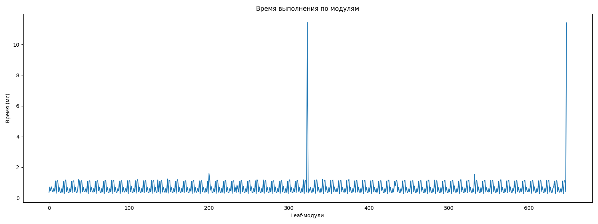
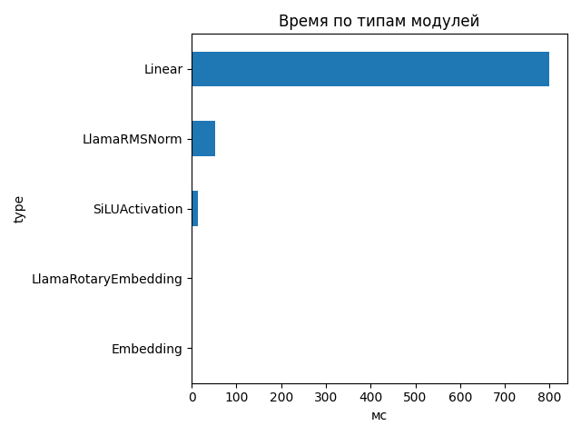
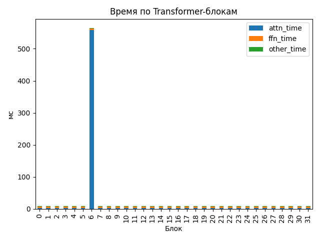

# Llama-3.1-Nemotron-Nano-4B-v1.1

## Общие параметры
- Время forward-pass: 240.76 ms
- Размер скрытого пространства: 3072
- Длина входной последовательности: 510
- Количество Transformer-блоков: 32
- Количество параметров: 4 118 544 384
- FLOPs / forward: 2908.63 GFLOPs
- Эффективная производительность: 12.08 TFLOPs

## Графики

## Transformer-блоки
- Размер скрытого пространства: 3072
- Размер внутреннего пространства FFN: 9216
- Отношение `ffn_dim / hidden_size`: 3.0
- Количество голов внимания: 32
- Количество K/V голов: 8
- Размер головы: 128
- Тип внимания: GQA
- Количество параметров в блоке: 116 391 936
- FLOPs attention: 33.139 GF
- FLOPs FFN: 57.756 GF
### Эффективность по блокам
| Номер блока | Эффективность (TFLOPs) | Номер блока | Эффективность (TFLOPs) |
|---|---|---|---|
| 0 | 9.43 | 1 | 9.71 |
| 2 | 9.71 | 3 | 9.88 |
| 4 | 9.78 | 5 | 9.13 |
| 6 | 0.16 | 7 | 9.32 |
| 8 | 9.69 | 9 | 9.88 |
| 10 | 9.87 | 11 | 9.88 |
| 12 | 9.86 | 13 | 9.88 |
| 14 | 9.87 | 15 | 9.43 |
| 16 | 9.51 | 17 | 9.85 |
| 18 | 9.85 | 19 | 9.86 |
| 20 | 9.83 | 21 | 9.63 |
| 22 | 9.80 | 23 | 9.74 |
| 24 | 9.88 | 25 | 9.51 |
| 26 | 9.87 | 27 | 9.42 |
| 28 | 9.86 | 29 | 9.94 |
| 30 | 9.92 | 31 | 9.86 |

## Сводная таблица времени по типам модулей
| Тип | Кол-во | Суммарное время (мс) | Среднее (мс) |
|-----|--------|------------------------|---------------|
| Linear | 450 | 799.876 | 1.7775 |
| LlamaRMSNorm | 130 | 52.213 | 0.4016 |
| SiLUActivation | 64 | 14.831 | 0.2317 |
| LlamaRotaryEmbedding | 2 | 1.406 | 0.7032 |
| Embedding | 2 | 0.678 | 0.3388 |

## Самые медленные модули (20)
- 555.931 ms — `model.layers.6.self_attn.o_proj` (Linear)
- 5.627 ms — `lm_head` (Linear)
- 5.624 ms — `lm_head` (Linear)
- 1.188 ms — `model.layers.16.mlp.up_proj` (Linear)
- 1.116 ms — `model.layers.25.mlp.up_proj` (Linear)
- 1.024 ms — `model.layers.5.post_attention_layernorm` (LlamaRMSNorm)
- 0.948 ms — `model.layers.15.self_attn.o_proj` (Linear)
- 0.814 ms — `model.layers.7.input_layernorm` (LlamaRMSNorm)
- 0.804 ms — `model.layers.27.self_attn.k_proj` (Linear)
- 0.802 ms — `model.layers.8.mlp.up_proj` (Linear)
- 0.784 ms — `model.layers.6.mlp.gate_proj` (Linear)
- 0.784 ms — `model.layers.6.post_attention_layernorm` (LlamaRMSNorm)
- 0.783 ms — `model.layers.11.mlp.gate_proj` (Linear)
- 0.780 ms — `model.layers.12.mlp.up_proj` (Linear)
- 0.779 ms — `model.layers.1.mlp.gate_proj` (Linear)
- 0.773 ms — `model.layers.20.mlp.gate_proj` (Linear)
- 0.767 ms — `model.layers.27.mlp.gate_proj` (Linear)
- 0.766 ms — `model.layers.24.mlp.gate_proj` (Linear)
- 0.765 ms — `model.layers.14.mlp.gate_proj` (Linear)
- 0.764 ms — `model.layers.30.mlp.gate_proj` (Linear)
