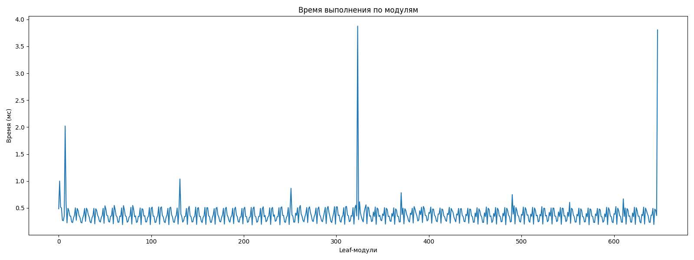
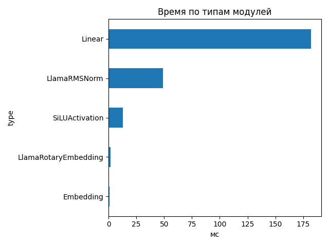

# Llama-3.1-Nemotron-Nano-4B-v1.1

## Общие параметры
- Время forward-pass: 200.51 ms
- Размер скрытого пространства: 3072
- Длина входной последовательности: 62
- Количество Transformer-блоков: 32
- Количество параметров: 4 118 544 384
- FLOPs / forward: 339.04 GFLOPs
- Эффективная производительность: 1.69 TFLOPs

## Графики

## Transformer-блоки
- Размер скрытого пространства: 3072
- Размер внутреннего пространства FFN: 9216
- Отношение `ffn_dim / hidden_size`: 3.0
- Количество голов внимания: 32
- Количество K/V голов: 8
- Размер головы: 128
- Тип внимания: GQA
- Количество параметров в блоке: 116 391 936
- FLOPs attention: 3.574 GF
- FLOPs FFN: 7.021 GF
### Эффективность по блокам
| Номер блока | Эффективность (TFLOPs) | Номер блока | Эффективность (TFLOPs) |
|---|---|---|---|
| 0 | 1.10 | 1 | 1.46 |
| 2 | 1.48 | 3 | 1.50 |
| 4 | 1.40 | 5 | 1.44 |
| 6 | 1.43 | 7 | 1.44 |
| 8 | 1.48 | 9 | 1.47 |
| 10 | 1.45 | 11 | 1.48 |
| 12 | 1.39 | 13 | 1.47 |
| 14 | 1.48 | 15 | 1.48 |
| 16 | 1.40 | 17 | 1.47 |
| 18 | 1.47 | 19 | 1.47 |
| 20 | 1.47 | 21 | 1.47 |
| 22 | 1.44 | 23 | 1.48 |
| 24 | 1.42 | 25 | 1.46 |
| 26 | 1.46 | 27 | 1.45 |
| 28 | 1.41 | 29 | 1.45 |
| 30 | 1.47 | 31 | 1.46 |

## Сводная таблица времени по типам модулей
| Тип | Кол-во | Суммарное время (мс) | Среднее (мс) |
|-----|--------|------------------------|---------------|
| Linear | 450 | 182.206 | 0.4049 |
| LlamaRMSNorm | 130 | 48.784 | 0.3753 |
| SiLUActivation | 64 | 13.070 | 0.2042 |
| LlamaRotaryEmbedding | 2 | 1.615 | 0.8073 |
| Embedding | 2 | 0.769 | 0.3847 |

## Самые медленные модули (20)
- 3.876 ms — `lm_head` (Linear)
- 3.805 ms — `lm_head` (Linear)
- 2.021 ms — `model.layers.0.post_attention_layernorm` (LlamaRMSNorm)
- 1.038 ms — `model.layers.12.mlp.down_proj` (Linear)
- 1.000 ms — `model.rotary_emb` (LlamaRotaryEmbedding)
- 0.864 ms — `model.layers.24.mlp.down_proj` (Linear)
- 0.783 ms — `model.layers.4.self_attn.o_proj` (Linear)
- 0.748 ms — `model.layers.16.self_attn.o_proj` (Linear)
- 0.669 ms — `model.layers.28.self_attn.o_proj` (Linear)
- 0.615 ms — `model.rotary_emb` (LlamaRotaryEmbedding)
- 0.605 ms — `model.layers.22.mlp.gate_proj` (Linear)
- 0.577 ms — `model.layers.0.mlp.gate_proj` (Linear)
- 0.559 ms — `model.layers.0.mlp.gate_proj` (Linear)
- 0.552 ms — `model.layers.31.mlp.down_proj` (Linear)
- 0.547 ms — `model.layers.5.mlp.up_proj` (Linear)
- 0.547 ms — `model.layers.25.mlp.down_proj` (Linear)
- 0.546 ms — `model.layers.7.mlp.up_proj` (Linear)
- 0.544 ms — `model.layers.6.mlp.up_proj` (Linear)
- 0.540 ms — `model.layers.16.mlp.gate_proj` (Linear)
- 0.540 ms — `model.layers.4.mlp.up_proj` (Linear)
