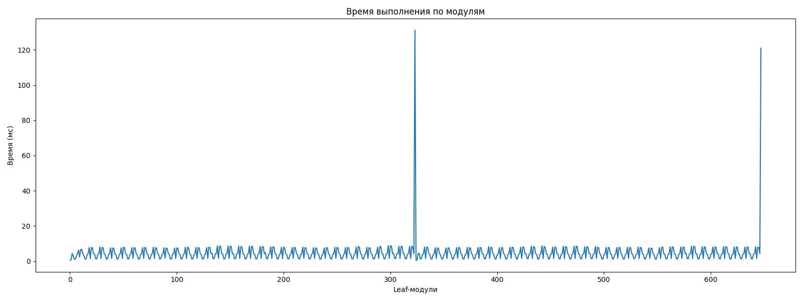
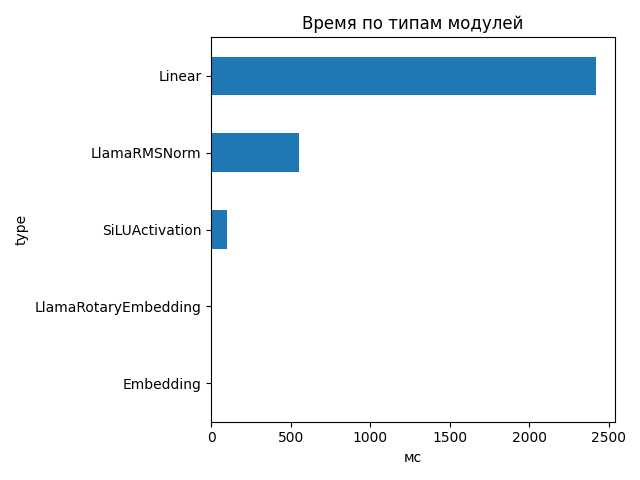
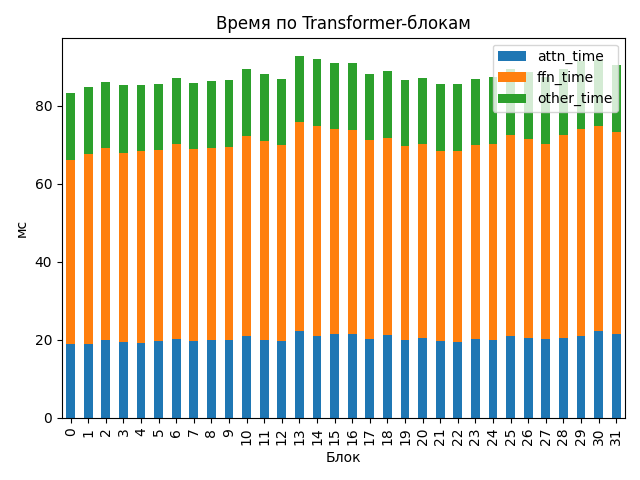

# Llama-3.1-Nemotron-Nano-4B-v1.1

## Общие параметры
- Время forward-pass: 2218.97 ms
- Размер скрытого пространства: 3072
- Длина входной последовательности: 8507
- Количество Transformer-блоков: 32
- Количество параметров: 4 118 544 384
- FLOPs / forward: 84184.73 GFLOPs
- Эффективная производительность: 37.94 TFLOPs

## Графики

## Transformer-блоки
- Размер скрытого пространства: 3072
- Размер внутреннего пространства FFN: 9216
- Отношение `ffn_dim / hidden_size`: 3.0
- Количество голов внимания: 32
- Количество K/V голов: 8
- Размер головы: 128
- Тип внимания: GQA
- Количество параметров в блоке: 116 391 936
- FLOPs attention: 1667.387 GF
- FLOPs FFN: 963.385 GF
### Эффективность по блокам
| Номер блока | Эффективность (TFLOPs) | Номер блока | Эффективность (TFLOPs) |
|---|---|---|---|
| 0 | 31.59 | 1 | 31.09 |
| 2 | 30.58 | 3 | 30.84 |
| 4 | 30.85 | 5 | 30.73 |
| 6 | 30.21 | 7 | 30.67 |
| 8 | 30.50 | 9 | 30.44 |
| 10 | 29.48 | 11 | 29.91 |
| 12 | 30.31 | 13 | 28.36 |
| 14 | 28.66 | 15 | 28.93 |
| 16 | 28.98 | 17 | 29.86 |
| 18 | 29.64 | 19 | 30.37 |
| 20 | 30.19 | 21 | 30.77 |
| 22 | 30.78 | 23 | 30.27 |
| 24 | 30.15 | 25 | 29.43 |
| 26 | 29.71 | 27 | 30.15 |
| 28 | 29.44 | 29 | 28.74 |
| 30 | 28.68 | 31 | 29.11 |

## Сводная таблица времени по типам модулей
| Тип | Кол-во | Суммарное время (мс) | Среднее (мс) |
|-----|--------|------------------------|---------------|
| Linear | 450 | 2417.138 | 5.3714 |
| LlamaRMSNorm | 130 | 554.906 | 4.2685 |
| SiLUActivation | 64 | 98.340 | 1.5366 |
| LlamaRotaryEmbedding | 2 | 1.518 | 0.7589 |
| Embedding | 2 | 1.033 | 0.5165 |

## Самые медленные модули (20)
- 131.132 ms — `lm_head` (Linear)
- 120.991 ms — `lm_head` (Linear)
- 8.822 ms — `model.layers.29.mlp.gate_proj` (Linear)
- 8.782 ms — `model.layers.11.mlp.gate_proj` (Linear)
- 8.724 ms — `model.layers.29.mlp.up_proj` (Linear)
- 8.651 ms — `model.layers.13.mlp.gate_proj` (Linear)
- 8.626 ms — `model.layers.14.mlp.gate_proj` (Linear)
- 8.590 ms — `model.layers.30.mlp.gate_proj` (Linear)
- 8.583 ms — `model.layers.10.mlp.gate_proj` (Linear)
- 8.576 ms — `model.layers.25.mlp.gate_proj` (Linear)
- 8.567 ms — `model.layers.16.mlp.gate_proj` (Linear)
- 8.564 ms — `model.layers.15.mlp.gate_proj` (Linear)
- 8.522 ms — `model.layers.29.mlp.down_proj` (Linear)
- 8.510 ms — `model.layers.13.mlp.down_proj` (Linear)
- 8.506 ms — `model.layers.13.mlp.gate_proj` (Linear)
- 8.505 ms — `model.layers.14.mlp.up_proj` (Linear)
- 8.497 ms — `model.layers.28.mlp.down_proj` (Linear)
- 8.495 ms — `model.layers.16.mlp.up_proj` (Linear)
- 8.480 ms — `model.layers.14.mlp.up_proj` (Linear)
- 8.471 ms — `model.layers.14.mlp.gate_proj` (Linear)
