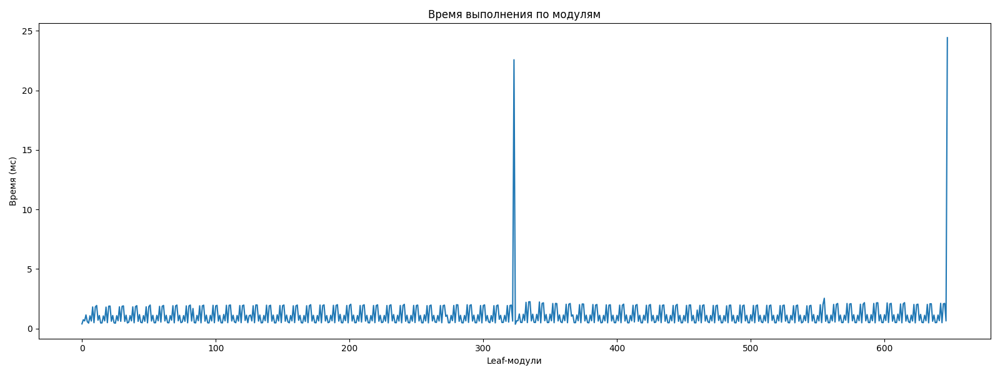
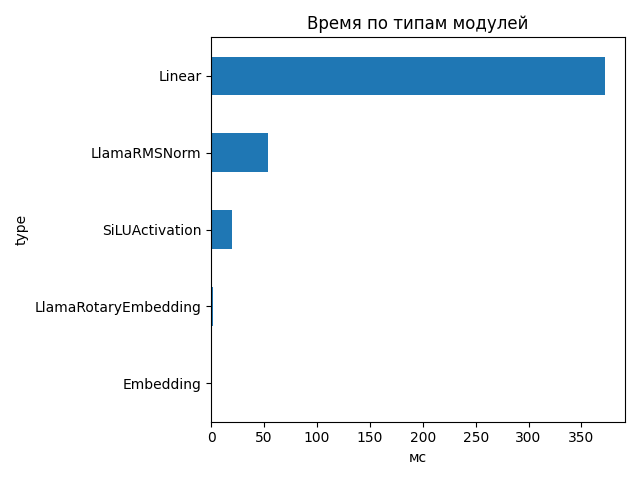
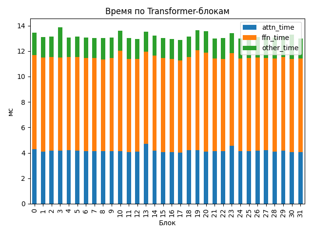

# Llama-3.1-Nemotron-Nano-4B-v1.1

## Общие параметры
- Время forward-pass: 320.24 ms
- Размер скрытого пространства: 3072
- Длина входной последовательности: 1063
- Количество Transformer-блоков: 32
- Количество параметров: 4 118 544 384
- FLOPs / forward: 6370.70 GFLOPs
- Эффективная производительность: 19.89 TFLOPs

## Графики

## Transformer-блоки
- Размер скрытого пространства: 3072
- Размер внутреннего пространства FFN: 9216
- Отношение `ffn_dim / hidden_size`: 3.0
- Количество голов внимания: 32
- Количество K/V голов: 8
- Размер головы: 128
- Тип внимания: GQA
- Количество параметров в блоке: 116 391 936
- FLOPs attention: 78.704 GF
- FLOPs FFN: 120.381 GF
### Эффективность по блокам
| Номер блока | Эффективность (TFLOPs) | Номер блока | Эффективность (TFLOPs) |
|---|---|---|---|
| 0 | 14.82 | 1 | 15.20 |
| 2 | 15.17 | 3 | 14.34 |
| 4 | 15.25 | 5 | 15.17 |
| 6 | 15.25 | 7 | 15.27 |
| 8 | 15.30 | 9 | 15.23 |
| 10 | 14.65 | 11 | 15.29 |
| 12 | 15.37 | 13 | 14.71 |
| 14 | 15.06 | 15 | 15.29 |
| 16 | 15.39 | 17 | 15.47 |
| 18 | 15.17 | 19 | 14.58 |
| 20 | 14.67 | 21 | 15.32 |
| 22 | 15.26 | 23 | 14.83 |
| 24 | 15.32 | 25 | 15.09 |
| 26 | 15.21 | 27 | 15.24 |
| 28 | 15.26 | 29 | 15.17 |
| 30 | 14.99 | 31 | 15.33 |

## Сводная таблица времени по типам модулей
| Тип | Кол-во | Суммарное время (мс) | Среднее (мс) |
|-----|--------|------------------------|---------------|
| Linear | 450 | 372.537 | 0.8279 |
| LlamaRMSNorm | 130 | 53.365 | 0.4105 |
| SiLUActivation | 64 | 19.343 | 0.3022 |
| LlamaRotaryEmbedding | 2 | 1.330 | 0.6652 |
| Embedding | 2 | 0.675 | 0.3373 |

## Самые медленные модули (20)
- 11.435 ms — `lm_head` (Linear)
- 11.412 ms — `lm_head` (Linear)
- 1.592 ms — `model.layers.19.mlp.up_proj` (Linear)
- 1.539 ms — `model.layers.20.mlp.gate_proj` (Linear)
- 1.235 ms — `model.layers.14.mlp.gate_proj` (Linear)
- 1.209 ms — `model.layers.10.mlp.down_proj` (Linear)
- 1.205 ms — `model.layers.1.mlp.gate_proj` (Linear)
- 1.205 ms — `model.layers.15.mlp.down_proj` (Linear)
- 1.205 ms — `model.layers.4.mlp.down_proj` (Linear)
- 1.201 ms — `model.layers.18.mlp.down_proj` (Linear)
- 1.195 ms — `model.layers.23.mlp.down_proj` (Linear)
- 1.195 ms — `model.layers.3.post_attention_layernorm` (LlamaRMSNorm)
- 1.187 ms — `model.layers.29.mlp.down_proj` (Linear)
- 1.184 ms — `model.layers.25.mlp.up_proj` (Linear)
- 1.180 ms — `model.layers.31.mlp.gate_proj` (Linear)
- 1.179 ms — `model.layers.0.mlp.up_proj` (Linear)
- 1.175 ms — `model.layers.13.self_attn.o_proj` (Linear)
- 1.175 ms — `model.layers.1.mlp.down_proj` (Linear)
- 1.169 ms — `model.layers.26.mlp.gate_proj` (Linear)
- 1.164 ms — `model.layers.28.mlp.up_proj` (Linear)
