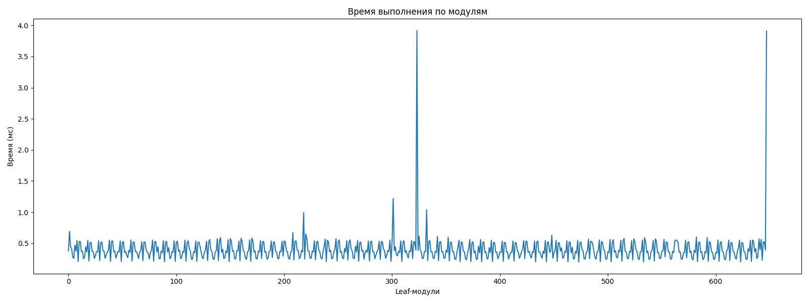
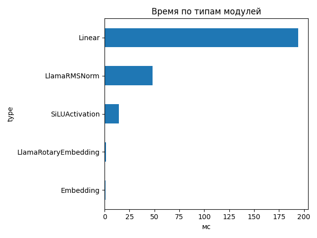
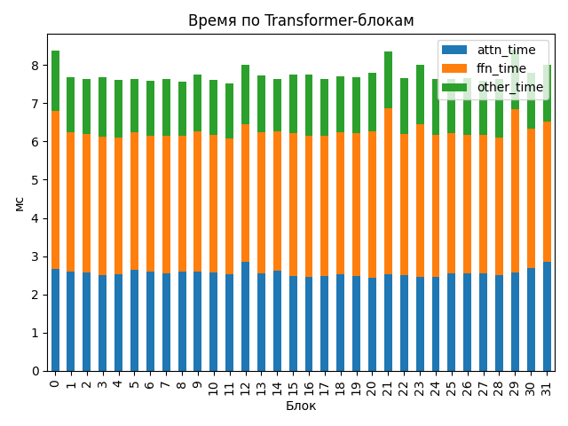

# Llama-3.1-Nemotron-Nano-4B-v1.1

## Общие параметры
- Время forward-pass: 207.09 ms
- Размер скрытого пространства: 3072
- Длина входной последовательности: 132
- Количество Transformer-блоков: 32
- Количество параметров: 4 118 544 384
- FLOPs / forward: 726.66 GFLOPs
- Эффективная производительность: 3.51 TFLOPs

## Графики

## Transformer-блоки
- Размер скрытого пространства: 3072
- Размер внутреннего пространства FFN: 9216
- Отношение `ffn_dim / hidden_size`: 3.0
- Количество голов внимания: 32
- Количество K/V голов: 8
- Размер головы: 128
- Тип внимания: GQA
- Количество параметров в блоке: 116 391 936
- FLOPs attention: 7.760 GF
- FLOPs FFN: 14.948 GF
### Эффективность по блокам
| Номер блока | Эффективность (TFLOPs) | Номер блока | Эффективность (TFLOPs) |
|---|---|---|---|
| 0 | 2.71 | 1 | 2.95 |
| 2 | 2.97 | 3 | 2.95 |
| 4 | 2.98 | 5 | 2.98 |
| 6 | 2.99 | 7 | 2.98 |
| 8 | 3.00 | 9 | 2.93 |
| 10 | 2.99 | 11 | 3.02 |
| 12 | 2.83 | 13 | 2.94 |
| 14 | 2.97 | 15 | 2.93 |
| 16 | 2.93 | 17 | 2.98 |
| 18 | 2.95 | 19 | 2.96 |
| 20 | 2.92 | 21 | 2.72 |
| 22 | 2.97 | 23 | 2.84 |
| 24 | 2.97 | 25 | 2.98 |
| 26 | 2.97 | 27 | 2.99 |
| 28 | 2.97 | 29 | 2.70 |
| 30 | 2.91 | 31 | 2.84 |

## Сводная таблица времени по типам модулей
| Тип | Кол-во | Суммарное время (мс) | Среднее (мс) |
|-----|--------|------------------------|---------------|
| Linear | 450 | 194.247 | 0.4317 |
| LlamaRMSNorm | 130 | 48.288 | 0.3714 |
| SiLUActivation | 64 | 14.360 | 0.2244 |
| LlamaRotaryEmbedding | 2 | 1.304 | 0.6520 |
| Embedding | 2 | 0.758 | 0.3790 |

## Самые медленные модули (20)
- 3.920 ms — `lm_head` (Linear)
- 3.908 ms — `lm_head` (Linear)
- 1.218 ms — `model.layers.29.mlp.down_proj` (Linear)
- 1.037 ms — `model.layers.0.mlp.gate_proj` (Linear)
- 0.992 ms — `model.layers.21.mlp.gate_proj` (Linear)
- 0.689 ms — `model.rotary_emb` (LlamaRotaryEmbedding)
- 0.668 ms — `model.layers.20.mlp.gate_proj` (Linear)
- 0.650 ms — `model.layers.21.mlp.up_proj` (Linear)
- 0.629 ms — `model.layers.12.self_attn.k_proj` (Linear)
- 0.615 ms — `model.rotary_emb` (LlamaRotaryEmbedding)
- 0.608 ms — `model.layers.1.mlp.gate_proj` (Linear)
- 0.600 ms — `model.layers.25.mlp.gate_proj` (Linear)
- 0.598 ms — `model.layers.2.mlp.gate_proj` (Linear)
- 0.593 ms — `model.layers.26.mlp.gate_proj` (Linear)
- 0.590 ms — `model.layers.13.mlp.down_proj` (Linear)
- 0.589 ms — `model.layers.20.mlp.up_proj` (Linear)
- 0.582 ms — `model.layers.16.mlp.up_proj` (Linear)
- 0.580 ms — `model.layers.15.mlp.up_proj` (Linear)
- 0.577 ms — `model.layers.21.mlp.down_proj` (Linear)
- 0.577 ms — `model.layers.18.mlp.down_proj` (Linear)
