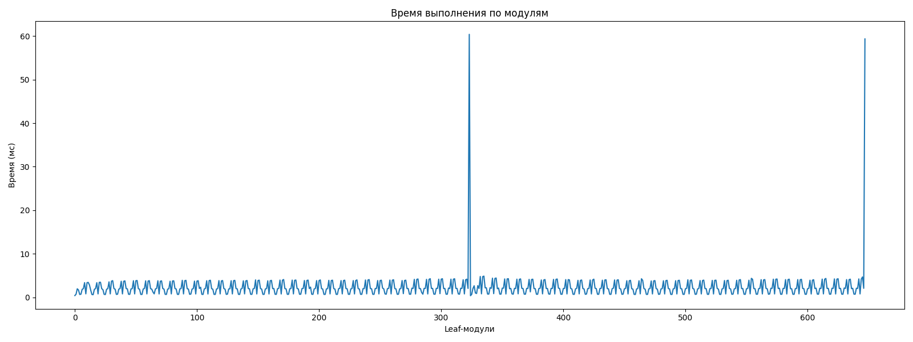
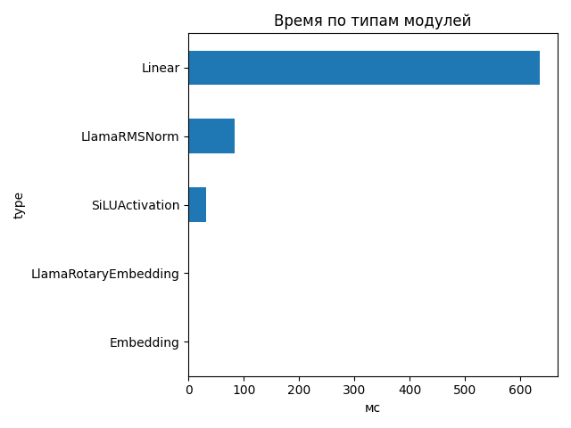
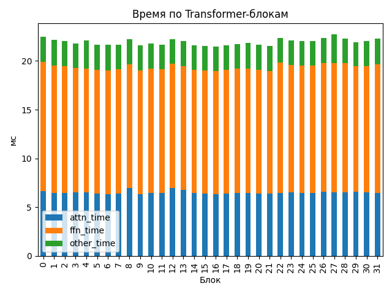

# Llama-3.1-Nemotron-Nano-4B-v1.1

## Общие параметры
- Время forward-pass: 522.49 ms
- Размер скрытого пространства: 3072
- Длина входной последовательности: 2137
- Количество Transformer-блоков: 32
- Количество параметров: 4 118 544 384
- FLOPs / forward: 14010.65 GFLOPs
- Эффективная производительность: 26.82 TFLOPs

## Графики

## Transformer-блоки
- Размер скрытого пространства: 3072
- Размер внутреннего пространства FFN: 9216
- Отношение `ffn_dim / hidden_size`: 3.0
- Количество голов внимания: 32
- Количество K/V голов: 8
- Размер головы: 128
- Тип внимания: GQA
- Количество параметров в блоке: 116 391 936
- FLOPs attention: 195.826 GF
- FLOPs FFN: 242.007 GF
### Эффективность по блокам
| Номер блока | Эффективность (TFLOPs) | Номер блока | Эффективность (TFLOPs) |
|---|---|---|---|
| 0 | 19.47 | 1 | 19.78 |
| 2 | 19.89 | 3 | 20.12 |
| 4 | 19.81 | 5 | 20.21 |
| 6 | 20.24 | 7 | 20.22 |
| 8 | 19.72 | 9 | 20.28 |
| 10 | 20.13 | 11 | 20.21 |
| 12 | 19.69 | 13 | 19.88 |
| 14 | 20.28 | 15 | 20.33 |
| 16 | 20.39 | 17 | 20.27 |
| 18 | 20.18 | 19 | 20.07 |
| 20 | 20.21 | 21 | 20.35 |
| 22 | 19.59 | 23 | 19.83 |
| 24 | 19.85 | 25 | 19.85 |
| 26 | 19.61 | 27 | 19.25 |
| 28 | 19.66 | 29 | 19.97 |
| 30 | 19.89 | 31 | 19.67 |

## Сводная таблица времени по типам модулей
| Тип | Кол-во | Суммарное время (мс) | Среднее (мс) |
|-----|--------|------------------------|---------------|
| Linear | 450 | 635.153 | 1.4115 |
| LlamaRMSNorm | 130 | 83.579 | 0.6429 |
| SiLUActivation | 64 | 31.449 | 0.4914 |
| LlamaRotaryEmbedding | 2 | 1.382 | 0.6910 |
| Embedding | 2 | 0.744 | 0.3722 |

## Самые медленные модули (20)
- 24.428 ms — `lm_head` (Linear)
- 22.572 ms — `lm_head` (Linear)
- 2.539 ms — `model.layers.22.mlp.down_proj` (Linear)
- 2.250 ms — `model.layers.0.mlp.down_proj` (Linear)
- 2.240 ms — `model.layers.0.mlp.up_proj` (Linear)
- 2.227 ms — `model.layers.1.mlp.gate_proj` (Linear)
- 2.198 ms — `model.layers.0.mlp.gate_proj` (Linear)
- 2.173 ms — `model.layers.28.mlp.down_proj` (Linear)
- 2.172 ms — `model.layers.25.mlp.down_proj` (Linear)
- 2.163 ms — `model.layers.26.mlp.down_proj` (Linear)
- 2.159 ms — `model.layers.1.mlp.down_proj` (Linear)
- 2.153 ms — `model.layers.26.mlp.up_proj` (Linear)
- 2.150 ms — `model.layers.27.mlp.gate_proj` (Linear)
- 2.115 ms — `model.layers.31.mlp.gate_proj` (Linear)
- 2.111 ms — `model.layers.27.mlp.down_proj` (Linear)
- 2.107 ms — `model.layers.31.mlp.down_proj` (Linear)
- 2.106 ms — `model.layers.2.mlp.up_proj` (Linear)
- 2.106 ms — `model.layers.26.mlp.gate_proj` (Linear)
- 2.105 ms — `model.layers.1.mlp.up_proj` (Linear)
- 2.102 ms — `model.layers.2.mlp.gate_proj` (Linear)
