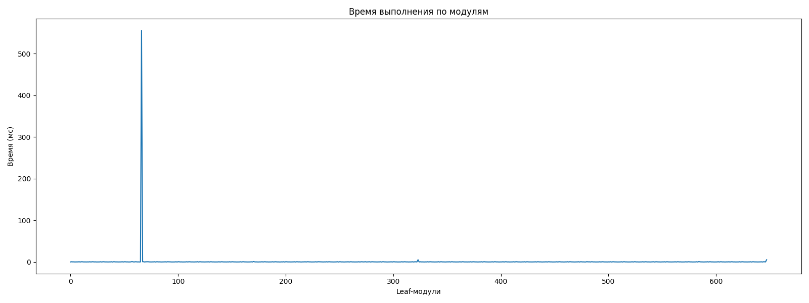
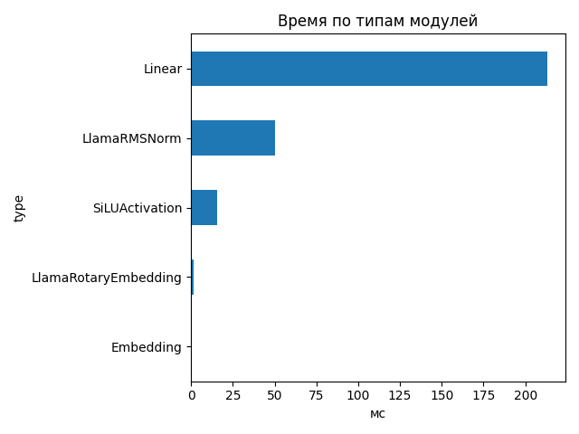
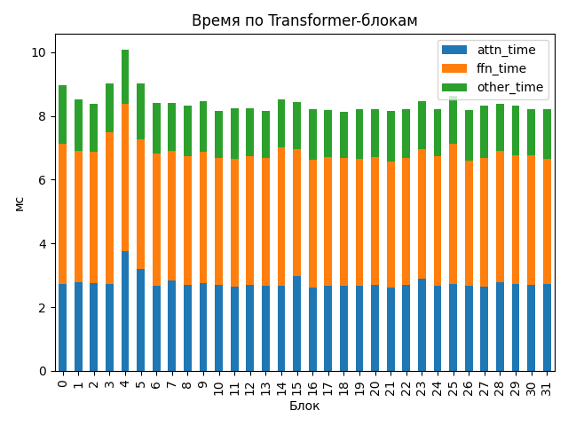

# Llama-3.1-Nemotron-Nano-4B-v1.1

## Общие параметры
- Время forward-pass: 225.77 ms
- Размер скрытого пространства: 3072
- Длина входной последовательности: 282
- Количество Transformer-блоков: 32
- Количество параметров: 4 118 544 384
- FLOPs / forward: 1574.59 GFLOPs
- Эффективная производительность: 6.97 TFLOPs

## Графики

## Transformer-блоки
- Размер скрытого пространства: 3072
- Размер внутреннего пространства FFN: 9216
- Отношение `ffn_dim / hidden_size`: 3.0
- Количество голов внимания: 32
- Количество K/V голов: 8
- Размер головы: 128
- Тип внимания: GQA
- Количество параметров в блоке: 116 391 936
- FLOPs attention: 17.271 GF
- FLOPs FFN: 31.935 GF
### Эффективность по блокам
| Номер блока | Эффективность (TFLOPs) | Номер блока | Эффективность (TFLOPs) |
|---|---|---|---|
| 0 | 5.49 | 1 | 5.78 |
| 2 | 5.88 | 3 | 5.46 |
| 4 | 4.88 | 5 | 5.46 |
| 6 | 5.85 | 7 | 5.86 |
| 8 | 5.92 | 9 | 5.82 |
| 10 | 6.03 | 11 | 5.97 |
| 12 | 5.98 | 13 | 6.03 |
| 14 | 5.77 | 15 | 5.84 |
| 16 | 5.99 | 17 | 6.01 |
| 18 | 6.04 | 19 | 6.00 |
| 20 | 6.00 | 21 | 6.04 |
| 22 | 6.00 | 23 | 5.82 |
| 24 | 5.98 | 25 | 5.70 |
| 26 | 6.02 | 27 | 5.91 |
| 28 | 5.88 | 29 | 5.91 |
| 30 | 5.99 | 31 | 6.00 |

## Сводная таблица времени по типам модулей
| Тип | Кол-во | Суммарное время (мс) | Среднее (мс) |
|-----|--------|------------------------|---------------|
| Linear | 450 | 213.335 | 0.4741 |
| LlamaRMSNorm | 130 | 50.442 | 0.3880 |
| SiLUActivation | 64 | 15.350 | 0.2398 |
| LlamaRotaryEmbedding | 2 | 1.291 | 0.6453 |
| Embedding | 2 | 0.657 | 0.3284 |

## Самые медленные модули (20)
- 4.458 ms — `lm_head` (Linear)
- 4.383 ms — `lm_head` (Linear)
- 1.030 ms — `model.layers.4.self_attn.q_proj` (Linear)
- 0.977 ms — `model.layers.25.mlp.gate_proj` (Linear)
- 0.955 ms — `model.layers.14.mlp.gate_proj` (Linear)
- 0.949 ms — `model.layers.3.mlp.act_fn` (SiLUActivation)
- 0.741 ms — `model.layers.4.mlp.down_proj` (Linear)
- 0.739 ms — `model.layers.15.self_attn.q_proj` (Linear)
- 0.736 ms — `model.layers.0.mlp.gate_proj` (Linear)
- 0.719 ms — `model.layers.4.mlp.gate_proj` (Linear)
- 0.716 ms — `model.layers.4.mlp.up_proj` (Linear)
- 0.690 ms — `model.layers.0.mlp.up_proj` (Linear)
- 0.685 ms — `model.rotary_emb` (LlamaRotaryEmbedding)
- 0.680 ms — `model.layers.9.mlp.gate_proj` (Linear)
- 0.677 ms — `model.layers.25.mlp.down_proj` (Linear)
- 0.667 ms — `model.layers.6.mlp.down_proj` (Linear)
- 0.658 ms — `model.layers.6.mlp.gate_proj` (Linear)
- 0.655 ms — `model.layers.27.mlp.down_proj` (Linear)
- 0.653 ms — `model.layers.11.mlp.down_proj` (Linear)
- 0.653 ms — `model.layers.1.mlp.down_proj` (Linear)
