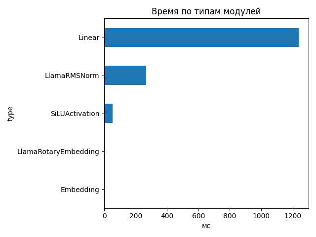
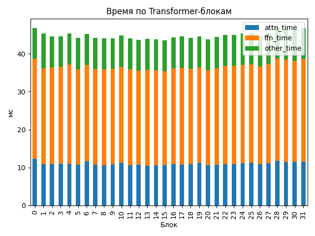

# Llama-3.1-Nemotron-Nano-4B-v1.1

## Общие параметры
- Время forward-pass: 1070.04 ms
- Размер скрытого пространства: 3072
- Длина входной последовательности: 4259
- Количество Transformer-блоков: 32
- Количество параметров: 4 118 544 384
- FLOPs / forward: 32661.25 GFLOPs
- Эффективная производительность: 30.52 TFLOPs

## Графики

## Transformer-блоки
- Размер скрытого пространства: 3072
- Размер внутреннего пространства FFN: 9216
- Отношение `ffn_dim / hidden_size`: 3.0
- Количество голов внимания: 32
- Количество K/V голов: 8
- Размер головы: 128
- Тип внимания: GQA
- Количество параметров в блоке: 116 391 936
- FLOPs attention: 538.349 GF
- FLOPs FFN: 482.316 GF
### Эффективность по блокам
| Номер блока | Эффективность (TFLOPs) | Номер блока | Эффективность (TFLOPs) |
|---|---|---|---|
| 0 | 21.80 | 1 | 22.54 |
| 2 | 22.88 | 3 | 22.90 |
| 4 | 22.52 | 5 | 23.13 |
| 6 | 22.56 | 7 | 23.08 |
| 8 | 23.17 | 9 | 23.15 |
| 10 | 22.77 | 11 | 23.16 |
| 12 | 23.35 | 13 | 23.26 |
| 14 | 23.31 | 15 | 23.44 |
| 16 | 23.03 | 17 | 22.94 |
| 18 | 23.11 | 19 | 22.91 |
| 20 | 23.30 | 21 | 23.01 |
| 22 | 22.71 | 23 | 22.68 |
| 24 | 22.53 | 25 | 22.43 |
| 26 | 22.82 | 27 | 22.44 |
| 28 | 21.75 | 29 | 21.84 |
| 30 | 22.05 | 31 | 21.82 |

## Сводная таблица времени по типам модулей
| Тип | Кол-во | Суммарное время (мс) | Среднее (мс) |
|-----|--------|------------------------|---------------|
| Linear | 450 | 1239.741 | 2.7550 |
| LlamaRMSNorm | 130 | 267.295 | 2.0561 |
| SiLUActivation | 64 | 52.355 | 0.8180 |
| LlamaRotaryEmbedding | 2 | 1.459 | 0.7294 |
| Embedding | 2 | 0.824 | 0.4120 |

## Самые медленные модули (20)
- 60.375 ms — `lm_head` (Linear)
- 59.323 ms — `lm_head` (Linear)
- 4.895 ms — `model.layers.0.mlp.down_proj` (Linear)
- 4.812 ms — `model.layers.0.mlp.gate_proj` (Linear)
- 4.779 ms — `model.layers.0.mlp.up_proj` (Linear)
- 4.706 ms — `model.layers.31.mlp.down_proj` (Linear)
- 4.460 ms — `model.layers.1.mlp.down_proj` (Linear)
- 4.425 ms — `model.layers.1.mlp.gate_proj` (Linear)
- 4.382 ms — `model.layers.22.mlp.up_proj` (Linear)
- 4.363 ms — `model.layers.1.mlp.up_proj` (Linear)
- 4.360 ms — `model.layers.28.mlp.down_proj` (Linear)
- 4.306 ms — `model.layers.28.mlp.down_proj` (Linear)
- 4.302 ms — `model.layers.2.mlp.down_proj` (Linear)
- 4.297 ms — `model.layers.29.mlp.down_proj` (Linear)
- 4.297 ms — `model.layers.29.mlp.down_proj` (Linear)
- 4.290 ms — `model.layers.13.mlp.up_proj` (Linear)
- 4.288 ms — `model.layers.30.mlp.down_proj` (Linear)
- 4.258 ms — `model.layers.3.mlp.down_proj` (Linear)
- 4.255 ms — `model.layers.29.mlp.gate_proj` (Linear)
- 4.253 ms — `model.layers.31.mlp.gate_proj` (Linear)
