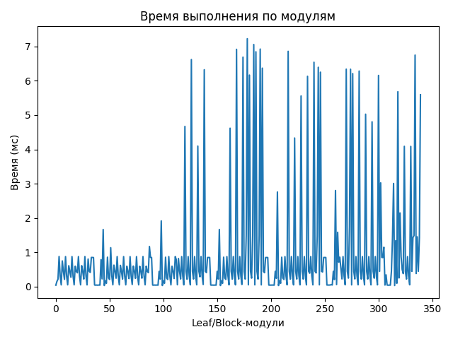
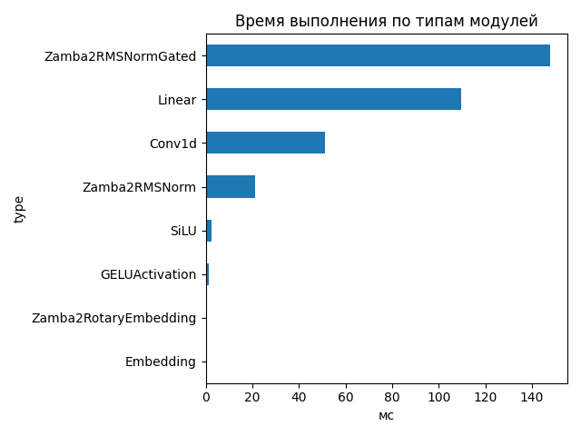
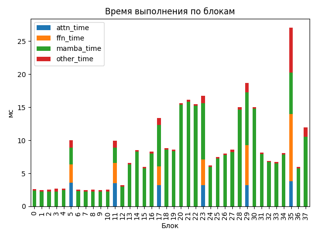

# Zamba2 1.2B

## Общие параметры
- Время forward-pass: 45368.62 ms
- Размер скрытого пространства: 2048
- Размер словаря: 32000
- Длина входной последовательности: 1024
- Количество блоков: 38
- Количество параметров: 1 215 064 704

## FLOPs (оценка по трейсу)
- Linear + Conv1d: 9516.13 GFLOPs (98.8%)
- Attention kernel (QK^T + AV): 103.08 GFLOPs (1.1%)
- Mamba SSM: 15.30 GFLOPs (0.2%)
- Итого: 9634.51 GFLOPs
- Эффективная производительность: 0.21 TFLOPs

## Графики

## Пример информации по одному блоку
- Номер блока: 0
- Есть Mamba-блок: True
- Есть Mamba decoder: False
- Есть shared Transformer: False
- Размер скрытого пространства: 2048
- Размер внутреннего пространства FFN (если есть): None
- FLOPs Attention: 0.000 GF
- FLOPs FFN: 0.000 GF
- FLOPs Mamba: 208.895 GF

### Эффективность по блокам
| Номер блока | Mamba (GF) | Attention (GF) | FFN (GF) | Эффективность (TFLOPs) |
|---|---|---|---|---|
| 0 | 208.895 | 0.000 | 0.000 | 79.36 |
| 1 | 208.895 | 0.000 | 0.000 | 84.12 |
| 2 | 208.895 | 0.000 | 0.000 | 82.61 |
| 3 | 208.895 | 0.000 | 0.000 | 78.12 |
| 4 | 208.895 | 0.000 | 0.000 | 77.79 |
| 5 | 208.895 | 143.881 | 107.911 | 46.90 |
| 6 | 208.895 | 0.000 | 0.000 | 82.63 |
| 7 | 208.895 | 0.000 | 0.000 | 84.37 |
| 8 | 208.895 | 0.000 | 0.000 | 83.41 |
| 9 | 208.895 | 0.000 | 0.000 | 83.73 |
| 10 | 208.895 | 0.000 | 0.000 | 83.40 |
| 11 | 208.895 | 143.881 | 107.911 | 47.24 |
| 12 | 208.895 | 0.000 | 0.000 | 65.35 |
| 13 | 208.895 | 0.000 | 0.000 | 31.87 |
| 14 | 208.895 | 0.000 | 0.000 | 24.57 |
| 15 | 208.895 | 0.000 | 0.000 | 34.91 |
| 16 | 208.895 | 0.000 | 0.000 | 25.21 |
| 17 | 208.895 | 143.881 | 107.911 | 35.02 |
| 18 | 208.895 | 0.000 | 0.000 | 23.72 |
| 19 | 208.895 | 0.000 | 0.000 | 24.33 |
| 20 | 208.895 | 0.000 | 0.000 | 13.39 |
| 21 | 208.895 | 0.000 | 0.000 | 12.96 |
| 22 | 208.895 | 0.000 | 0.000 | 13.50 |
| 23 | 208.895 | 143.881 | 107.911 | 28.03 |
| 24 | 208.895 | 0.000 | 0.000 | 33.61 |
| 25 | 208.895 | 0.000 | 0.000 | 28.06 |
| 26 | 208.895 | 0.000 | 0.000 | 26.05 |
| 27 | 208.895 | 0.000 | 0.000 | 24.29 |
| 28 | 208.895 | 0.000 | 0.000 | 13.92 |
| 29 | 208.895 | 143.881 | 107.911 | 25.16 |
| 30 | 208.895 | 0.000 | 0.000 | 13.91 |
| 31 | 208.895 | 0.000 | 0.000 | 25.56 |
| 32 | 208.895 | 0.000 | 0.000 | 30.24 |
| 33 | 208.895 | 0.000 | 0.000 | 31.23 |
| 34 | 208.895 | 0.000 | 0.000 | 25.89 |
| 35 | 208.895 | 143.881 | 107.911 | 17.33 |
| 36 | 208.895 | 0.000 | 0.000 | 34.98 |
| 37 | 208.895 | 0.000 | 0.000 | 17.51 |

## Сводная таблица времени по типам модулей
| Тип | Кол-во | Суммарное время (мс) | Среднее (мс) |
|-----|--------|------------------------|---------------|
| Zamba2RMSNormGated | 38 | 147.825 | 3.8901 |
| Linear | 167 | 109.645 | 0.6566 |
| Conv1d | 38 | 51.177 | 1.3468 |
| Zamba2RMSNorm | 51 | 21.151 | 0.4147 |
| SiLU | 38 | 2.514 | 0.0662 |
| GELUActivation | 6 | 1.172 | 0.1953 |
| Zamba2RotaryEmbedding | 1 | 0.147 | 0.1475 |
| Embedding | 1 | 0.038 | 0.0376 |

## Самые медленные модули (20)
- 7.229 ms — `model.layers.20.mamba.conv1d` (Conv1d)
- 7.060 ms — `model.layers.21.mamba.conv1d` (Conv1d)
- 6.927 ms — `model.layers.22.mamba.conv1d` (Conv1d)
- 6.920 ms — `model.layers.18.mamba.norm` (Zamba2RMSNormGated)
- 6.862 ms — `model.layers.23.mamba_decoder.mamba.norm` (Zamba2RMSNormGated)
- 6.848 ms — `model.layers.21.mamba.norm` (Zamba2RMSNormGated)
- 6.751 ms — `model.layers.37.mamba.conv1d` (Conv1d)
- 6.691 ms — `model.layers.19.mamba.norm` (Zamba2RMSNormGated)
- 6.620 ms — `model.layers.14.mamba.norm` (Zamba2RMSNormGated)
- 6.542 ms — `model.layers.27.mamba.norm` (Zamba2RMSNormGated)
- 6.396 ms — `model.layers.28.mamba.conv1d` (Conv1d)
- 6.370 ms — `model.layers.22.mamba.norm` (Zamba2RMSNormGated)
- 6.341 ms — `model.layers.29.mamba_decoder.mamba.norm` (Zamba2RMSNormGated)
- 6.339 ms — `model.layers.30.mamba.conv1d` (Conv1d)
- 6.324 ms — `model.layers.16.mamba.norm` (Zamba2RMSNormGated)
- 6.285 ms — `model.layers.31.mamba.norm` (Zamba2RMSNormGated)
- 6.253 ms — `model.layers.28.mamba.norm` (Zamba2RMSNormGated)
- 6.213 ms — `model.layers.30.mamba.norm` (Zamba2RMSNormGated)
- 6.168 ms — `model.layers.20.mamba.norm` (Zamba2RMSNormGated)
- 6.158 ms — `model.layers.34.mamba.norm` (Zamba2RMSNormGated)
