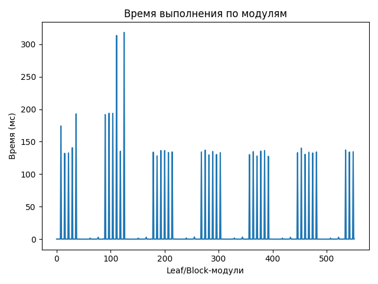
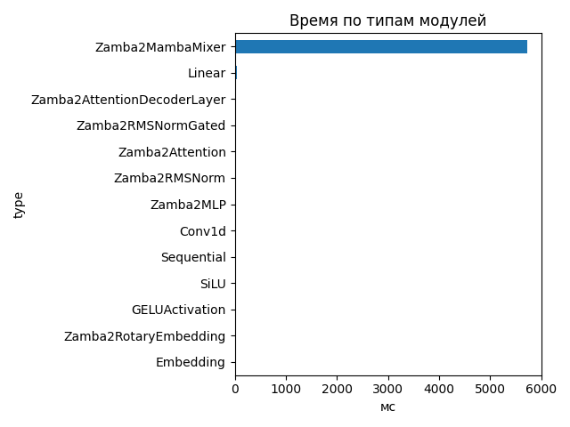
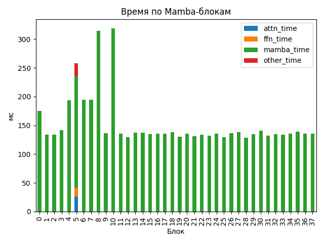

# Zamba2 1.2B

## Общие параметры
- Время forward-pass: 5752.88 ms
- Размер скрытого пространства: 2048
- Размер словаря: 32000
- Длина входной последовательности: 112
- Количество блоков: 38
- Количество параметров: 1 280 351 744

## FLOPs (оценка по трейсу)
- Linear + Conv1d: 1349.43 GFLOPs (99.7%)
- Attention kernel (QK^T + AV): 2.47 GFLOPs (0.2%)
- Mamba SSM: 1.94 GFLOPs (0.1%)
- Итого: 1353.83 GFLOPs
- Эффективная производительность: 0.24 TFLOPs

## Графики

## Пример информации по одному блоку
- Номер блока: 0
- Есть Mamba-блок: False
- Есть Mamba decoder: False
- Есть shared Transformer: False
- Размер скрытого пространства: 2048
- Размер внутреннего пространства FFN (если есть): None
- FLOPs Attention: 0.000 GF
- FLOPs FFN: 0.000 GF
- FLOPs Mamba: 23.253 GF

### Эффективность по блокам
| Номер блока | Mamba (GF) | Attention (GF) | FFN (GF) | Эффективность (TFLOPs) |
|---|---|---|---|---|
| 0 | 23.253 | 0.000 | 0.000 | 0.13 |
| 1 | 23.253 | 0.000 | 0.000 | 0.17 |
| 2 | 23.253 | 0.000 | 0.000 | 0.17 |
| 3 | 23.253 | 0.000 | 0.000 | 0.16 |
| 4 | 23.253 | 0.000 | 0.000 | 0.12 |
| 5 | 46.505 | 168.762 | 141.633 | 1.39 |
| 6 | 23.253 | 0.000 | 0.000 | 0.12 |
| 7 | 23.253 | 0.000 | 0.000 | 0.12 |
| 8 | 23.253 | 0.000 | 0.000 | 0.07 |
| 9 | 23.253 | 0.000 | 0.000 | 0.17 |
| 10 | 23.253 | 0.000 | 0.000 | 0.07 |
| 11 | 46.505 | 0.000 | 0.000 | 0.35 |
| 12 | 23.253 | 0.000 | 0.000 | 0.18 |
| 13 | 23.253 | 0.000 | 0.000 | 0.17 |
| 14 | 23.253 | 0.000 | 0.000 | 0.17 |
| 15 | 23.253 | 0.000 | 0.000 | 0.17 |
| 16 | 23.253 | 0.000 | 0.000 | 0.17 |
| 17 | 46.505 | 0.000 | 0.000 | 0.35 |
| 18 | 23.253 | 0.000 | 0.000 | 0.17 |
| 19 | 23.253 | 0.000 | 0.000 | 0.18 |
| 20 | 23.253 | 0.000 | 0.000 | 0.17 |
| 21 | 23.253 | 0.000 | 0.000 | 0.18 |
| 22 | 23.253 | 0.000 | 0.000 | 0.17 |
| 23 | 46.505 | 0.000 | 0.000 | 0.36 |
| 24 | 23.253 | 0.000 | 0.000 | 0.17 |
| 25 | 23.253 | 0.000 | 0.000 | 0.18 |
| 26 | 23.253 | 0.000 | 0.000 | 0.17 |
| 27 | 23.253 | 0.000 | 0.000 | 0.17 |
| 28 | 23.253 | 0.000 | 0.000 | 0.18 |
| 29 | 46.505 | 0.000 | 0.000 | 0.35 |
| 30 | 23.253 | 0.000 | 0.000 | 0.16 |
| 31 | 23.253 | 0.000 | 0.000 | 0.18 |
| 32 | 23.253 | 0.000 | 0.000 | 0.17 |
| 33 | 23.253 | 0.000 | 0.000 | 0.17 |
| 34 | 23.253 | 0.000 | 0.000 | 0.17 |
| 35 | 46.505 | 0.000 | 0.000 | 0.34 |
| 36 | 23.253 | 0.000 | 0.000 | 0.17 |
| 37 | 23.253 | 0.000 | 0.000 | 0.17 |

## Сводная таблица времени по типам модулей
| Тип | Кол-во | Суммарное время (мс) | Среднее (мс) |
|-----|--------|------------------------|---------------|
| Zamba2MambaMixer | 38 | 5721.460 | 150.5647 |
| Linear | 263 | 40.706 | 0.1548 |
| Zamba2AttentionDecoderLayer | 6 | 18.765 | 3.1275 |
| Zamba2RMSNormGated | 44 | 16.443 | 0.3737 |
| Zamba2Attention | 6 | 10.389 | 1.7315 |
| Zamba2RMSNorm | 63 | 9.500 | 0.1508 |
| Zamba2MLP | 6 | 5.547 | 0.9245 |
| Conv1d | 44 | 5.132 | 0.1166 |
| Sequential | 24 | 4.069 | 0.1696 |
| SiLU | 44 | 1.953 | 0.0444 |
| GELUActivation | 12 | 0.624 | 0.0520 |
| Zamba2RotaryEmbedding | 1 | 0.252 | 0.2524 |
| Embedding | 1 | 0.235 | 0.2346 |

## Самые медленные модули (20)
- 318.022 ms — `model.layers.10.mamba` (Zamba2MambaMixer)
- 313.348 ms — `model.layers.8.mamba` (Zamba2MambaMixer)
- 193.694 ms — `model.layers.6.mamba` (Zamba2MambaMixer)
- 193.624 ms — `model.layers.7.mamba` (Zamba2MambaMixer)
- 192.744 ms — `model.layers.4.mamba` (Zamba2MambaMixer)
- 191.628 ms — `model.layers.5.mamba_decoder.mamba` (Zamba2MambaMixer)
- 174.149 ms — `model.layers.0.mamba` (Zamba2MambaMixer)
- 140.685 ms — `model.layers.3.mamba` (Zamba2MambaMixer)
- 140.146 ms — `model.layers.30.mamba` (Zamba2MambaMixer)
- 137.184 ms — `model.layers.35.mamba_decoder.mamba` (Zamba2MambaMixer)
- 136.978 ms — `model.layers.18.mamba` (Zamba2MambaMixer)
- 136.363 ms — `model.layers.27.mamba` (Zamba2MambaMixer)
- 136.328 ms — `model.layers.13.mamba` (Zamba2MambaMixer)
- 136.247 ms — `model.layers.14.mamba` (Zamba2MambaMixer)
- 135.459 ms — `model.layers.26.mamba` (Zamba2MambaMixer)
- 135.237 ms — `model.layers.9.mamba` (Zamba2MambaMixer)
- 134.850 ms — `model.layers.20.mamba` (Zamba2MambaMixer)
- 134.675 ms — `model.layers.24.mamba` (Zamba2MambaMixer)
- 134.560 ms — `model.layers.37.mamba` (Zamba2MambaMixer)
- 134.236 ms — `model.layers.16.mamba` (Zamba2MambaMixer)
