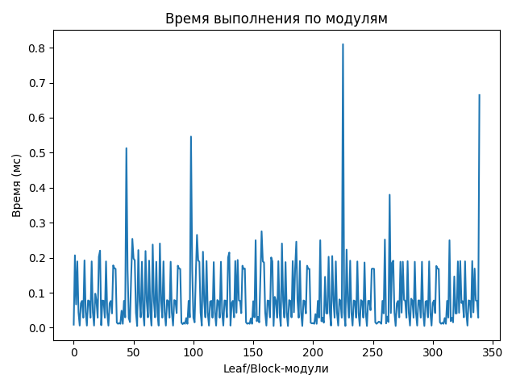
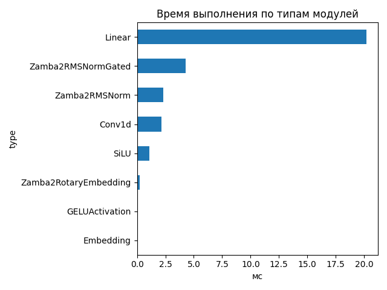
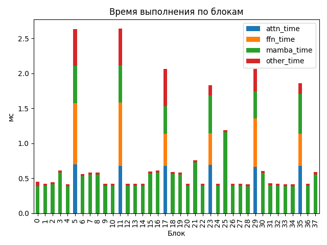

# Zamba2 1.2B

## Общие параметры
- Время forward-pass: 1635.72 ms
- Размер скрытого пространства: 2048
- Размер словаря: 32000
- Длина входной последовательности: 128
- Количество блоков: 38
- Количество параметров: 1 215 064 704

## FLOPs (оценка по трейсу)
- Linear + Conv1d: 1204.63 GFLOPs (99.7%)
- Attention kernel (QK^T + AV): 1.61 GFLOPs (0.1%)
- Mamba SSM: 1.91 GFLOPs (0.2%)
- Итого: 1208.15 GFLOPs
- Эффективная производительность: 0.74 TFLOPs

## Графики

## Пример информации по одному блоку
- Номер блока: 0
- Есть Mamba-блок: True
- Есть Mamba decoder: False
- Есть shared Transformer: False
- Размер скрытого пространства: 2048
- Размер внутреннего пространства FFN (если есть): None
- FLOPs Attention: 0.000 GF
- FLOPs FFN: 0.000 GF
- FLOPs Mamba: 26.510 GF

### Эффективность по блокам
| Номер блока | Mamba (GF) | Attention (GF) | FFN (GF) | Эффективность (TFLOPs) |
|---|---|---|---|---|
| 0 | 26.510 | 0.000 | 0.000 | 58.57 |
| 1 | 26.510 | 0.000 | 0.000 | 62.40 |
| 2 | 26.510 | 0.000 | 0.000 | 59.95 |
| 3 | 26.510 | 0.000 | 0.000 | 43.23 |
| 4 | 26.510 | 0.000 | 0.000 | 64.07 |
| 5 | 26.510 | 16.106 | 13.489 | 21.70 |
| 6 | 26.510 | 0.000 | 0.000 | 46.99 |
| 7 | 26.510 | 0.000 | 0.000 | 45.32 |
| 8 | 26.510 | 0.000 | 0.000 | 45.27 |
| 9 | 26.510 | 0.000 | 0.000 | 62.80 |
| 10 | 26.510 | 0.000 | 0.000 | 62.82 |
| 11 | 26.510 | 16.106 | 13.489 | 21.63 |
| 12 | 26.510 | 0.000 | 0.000 | 62.98 |
| 13 | 26.510 | 0.000 | 0.000 | 63.12 |
| 14 | 26.510 | 0.000 | 0.000 | 62.81 |
| 15 | 26.510 | 0.000 | 0.000 | 44.33 |
| 16 | 26.510 | 0.000 | 0.000 | 43.36 |
| 17 | 26.510 | 16.106 | 13.489 | 27.68 |
| 18 | 26.510 | 0.000 | 0.000 | 45.04 |
| 19 | 26.510 | 0.000 | 0.000 | 45.37 |
| 20 | 26.510 | 0.000 | 0.000 | 63.08 |
| 21 | 26.510 | 0.000 | 0.000 | 35.08 |
| 22 | 26.510 | 0.000 | 0.000 | 63.00 |
| 23 | 26.510 | 16.106 | 13.489 | 31.17 |
| 24 | 26.510 | 0.000 | 0.000 | 62.38 |
| 25 | 26.510 | 0.000 | 0.000 | 22.34 |
| 26 | 26.510 | 0.000 | 0.000 | 62.58 |
| 27 | 26.510 | 0.000 | 0.000 | 62.95 |
| 28 | 26.510 | 0.000 | 0.000 | 63.56 |
| 29 | 26.510 | 16.106 | 13.489 | 27.71 |
| 30 | 26.510 | 0.000 | 0.000 | 43.76 |
| 31 | 26.510 | 0.000 | 0.000 | 62.00 |
| 32 | 26.510 | 0.000 | 0.000 | 62.81 |
| 33 | 26.510 | 0.000 | 0.000 | 63.47 |
| 34 | 26.510 | 0.000 | 0.000 | 63.63 |
| 35 | 26.510 | 16.106 | 13.489 | 30.70 |
| 36 | 26.510 | 0.000 | 0.000 | 62.49 |
| 37 | 26.510 | 0.000 | 0.000 | 45.12 |

## Сводная таблица времени по типам модулей
| Тип | Кол-во | Суммарное время (мс) | Среднее (мс) |
|-----|--------|------------------------|---------------|
| Linear | 167 | 20.214 | 0.1210 |
| Zamba2RMSNormGated | 38 | 4.300 | 0.1132 |
| Zamba2RMSNorm | 51 | 2.289 | 0.0449 |
| Conv1d | 38 | 2.139 | 0.0563 |
| SiLU | 38 | 1.103 | 0.0290 |
| Zamba2RotaryEmbedding | 1 | 0.207 | 0.2068 |
| GELUActivation | 6 | 0.093 | 0.0155 |
| Embedding | 1 | 0.009 | 0.0088 |

## Самые медленные модули (20)
- 0.810 ms — `model.layers.25.mamba.in_proj` (Linear)
- 0.665 ms — `lm_head` (Linear)
- 0.546 ms — `model.layers.5.shared_transformer.feed_forward.gate_up_proj` (Linear)
- 0.513 ms — `model.layers.5.shared_transformer.feed_forward.gate_up_proj` (Linear)
- 0.380 ms — `model.layers.5.shared_transformer.feed_forward.down_proj` (Linear)
- 0.275 ms — `model.layers.17.linear` (Linear)
- 0.265 ms — `model.layers.11.linear` (Linear)
- 0.254 ms — `model.layers.5.linear` (Linear)
- 0.252 ms — `model.layers.5.shared_transformer.feed_forward.gate_up_proj` (Linear)
- 0.250 ms — `model.layers.5.shared_transformer.feed_forward.gate_up_proj` (Linear)
- 0.250 ms — `model.layers.5.shared_transformer.feed_forward.gate_up_proj` (Linear)
- 0.250 ms — `model.layers.5.shared_transformer.feed_forward.gate_up_proj` (Linear)
- 0.246 ms — `model.layers.21.mamba.norm` (Zamba2RMSNormGated)
- 0.241 ms — `model.layers.8.mamba.norm` (Zamba2RMSNormGated)
- 0.241 ms — `model.layers.19.mamba.norm` (Zamba2RMSNormGated)
- 0.238 ms — `model.layers.7.mamba.norm` (Zamba2RMSNormGated)
- 0.223 ms — `model.layers.25.mamba.norm` (Zamba2RMSNormGated)
- 0.222 ms — `model.layers.5.mamba_decoder.mamba.norm` (Zamba2RMSNormGated)
- 0.220 ms — `model.layers.3.mamba.conv1d` (Conv1d)
- 0.219 ms — `model.layers.6.mamba.norm` (Zamba2RMSNormGated)
