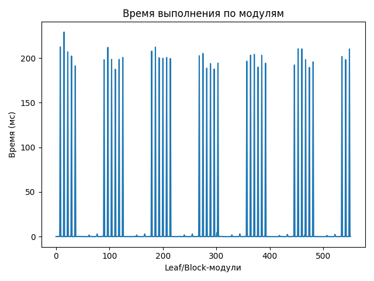
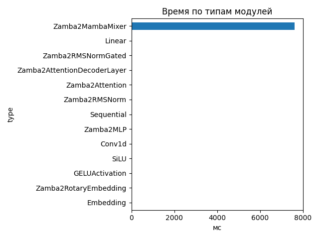
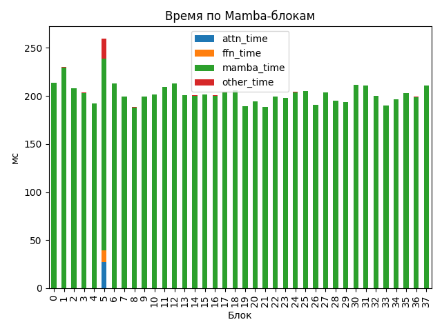

# Zamba2 1.2B

## Общие параметры
- Время forward-pass: 7652.86 ms
- Размер скрытого пространства: 2048
- Размер словаря: 32000
- Длина входной последовательности: 13
- Количество блоков: 38
- Количество параметров: 1 280 351 744

## FLOPs (оценка по трейсу)
- Linear + Conv1d: 174.31 GFLOPs (99.9%)
- Attention kernel (QK^T + AV): 0.03 GFLOPs (0.0%)
- Mamba SSM: 0.22 GFLOPs (0.1%)
- Итого: 174.57 GFLOPs
- Эффективная производительность: 0.02 TFLOPs

## Графики

## Пример информации по одному блоку
- Номер блока: 0
- Есть Mamba-блок: False
- Есть Mamba decoder: False
- Есть shared Transformer: False
- Размер скрытого пространства: 2048
- Размер внутреннего пространства FFN (если есть): None
- FLOPs Attention: 0.000 GF
- FLOPs FFN: 0.000 GF
- FLOPs Mamba: 3.101 GF

### Эффективность по блокам
| Номер блока | Mamba (GF) | Attention (GF) | FFN (GF) | Эффективность (TFLOPs) |
|---|---|---|---|---|
| 0 | 3.101 | 0.000 | 0.000 | 0.01 |
| 1 | 3.101 | 0.000 | 0.000 | 0.01 |
| 2 | 3.101 | 0.000 | 0.000 | 0.01 |
| 3 | 3.101 | 0.000 | 0.000 | 0.02 |
| 4 | 3.101 | 0.000 | 0.000 | 0.02 |
| 5 | 6.202 | 19.335 | 16.440 | 0.16 |
| 6 | 3.101 | 0.000 | 0.000 | 0.01 |
| 7 | 3.101 | 0.000 | 0.000 | 0.02 |
| 8 | 3.101 | 0.000 | 0.000 | 0.02 |
| 9 | 3.101 | 0.000 | 0.000 | 0.02 |
| 10 | 3.101 | 0.000 | 0.000 | 0.02 |
| 11 | 6.202 | 0.000 | 0.000 | 0.03 |
| 12 | 3.101 | 0.000 | 0.000 | 0.01 |
| 13 | 3.101 | 0.000 | 0.000 | 0.02 |
| 14 | 3.101 | 0.000 | 0.000 | 0.02 |
| 15 | 3.101 | 0.000 | 0.000 | 0.02 |
| 16 | 3.101 | 0.000 | 0.000 | 0.02 |
| 17 | 6.202 | 0.000 | 0.000 | 0.03 |
| 18 | 3.101 | 0.000 | 0.000 | 0.02 |
| 19 | 3.101 | 0.000 | 0.000 | 0.02 |
| 20 | 3.101 | 0.000 | 0.000 | 0.02 |
| 21 | 3.101 | 0.000 | 0.000 | 0.02 |
| 22 | 3.101 | 0.000 | 0.000 | 0.02 |
| 23 | 6.202 | 0.000 | 0.000 | 0.03 |
| 24 | 3.101 | 0.000 | 0.000 | 0.02 |
| 25 | 3.101 | 0.000 | 0.000 | 0.02 |
| 26 | 3.101 | 0.000 | 0.000 | 0.02 |
| 27 | 3.101 | 0.000 | 0.000 | 0.02 |
| 28 | 3.101 | 0.000 | 0.000 | 0.02 |
| 29 | 6.202 | 0.000 | 0.000 | 0.03 |
| 30 | 3.101 | 0.000 | 0.000 | 0.01 |
| 31 | 3.101 | 0.000 | 0.000 | 0.01 |
| 32 | 3.101 | 0.000 | 0.000 | 0.02 |
| 33 | 3.101 | 0.000 | 0.000 | 0.02 |
| 34 | 3.101 | 0.000 | 0.000 | 0.02 |
| 35 | 6.202 | 0.000 | 0.000 | 0.03 |
| 36 | 3.101 | 0.000 | 0.000 | 0.02 |
| 37 | 3.101 | 0.000 | 0.000 | 0.01 |

## Сводная таблица времени по типам модулей
| Тип | Кол-во | Суммарное время (мс) | Среднее (мс) |
|-----|--------|------------------------|---------------|
| Zamba2MambaMixer | 38 | 7623.808 | 200.6265 |
| Linear | 263 | 33.960 | 0.1291 |
| Zamba2RMSNormGated | 44 | 21.095 | 0.4794 |
| Zamba2AttentionDecoderLayer | 6 | 17.551 | 2.9252 |
| Zamba2Attention | 6 | 10.695 | 1.7825 |
| Zamba2RMSNorm | 63 | 8.043 | 0.1277 |
| Sequential | 24 | 4.554 | 0.1898 |
| Zamba2MLP | 6 | 4.489 | 0.7482 |
| Conv1d | 44 | 4.256 | 0.0967 |
| SiLU | 44 | 2.141 | 0.0487 |
| GELUActivation | 12 | 0.526 | 0.0438 |
| Zamba2RotaryEmbedding | 1 | 0.246 | 0.2456 |
| Embedding | 1 | 0.124 | 0.1237 |

## Самые медленные модули (20)
- 228.996 ms — `model.layers.1.mamba` (Zamba2MambaMixer)
- 212.380 ms — `model.layers.0.mamba` (Zamba2MambaMixer)
- 212.203 ms — `model.layers.12.mamba` (Zamba2MambaMixer)
- 211.842 ms — `model.layers.6.mamba` (Zamba2MambaMixer)
- 210.375 ms — `model.layers.30.mamba` (Zamba2MambaMixer)
- 210.133 ms — `model.layers.31.mamba` (Zamba2MambaMixer)
- 210.033 ms — `model.layers.37.mamba` (Zamba2MambaMixer)
- 207.701 ms — `model.layers.11.mamba_decoder.mamba` (Zamba2MambaMixer)
- 206.823 ms — `model.layers.2.mamba` (Zamba2MambaMixer)
- 205.048 ms — `model.layers.18.mamba` (Zamba2MambaMixer)
- 204.007 ms — `model.layers.25.mamba` (Zamba2MambaMixer)
- 203.194 ms — `model.layers.24.mamba` (Zamba2MambaMixer)
- 203.092 ms — `model.layers.27.mamba` (Zamba2MambaMixer)
- 202.536 ms — `model.layers.17.mamba_decoder.mamba` (Zamba2MambaMixer)
- 202.172 ms — `model.layers.3.mamba` (Zamba2MambaMixer)
- 201.653 ms — `model.layers.35.mamba_decoder.mamba` (Zamba2MambaMixer)
- 200.653 ms — `model.layers.10.mamba` (Zamba2MambaMixer)
- 200.531 ms — `model.layers.15.mamba` (Zamba2MambaMixer)
- 200.236 ms — `model.layers.13.mamba` (Zamba2MambaMixer)
- 199.602 ms — `model.layers.14.mamba` (Zamba2MambaMixer)
