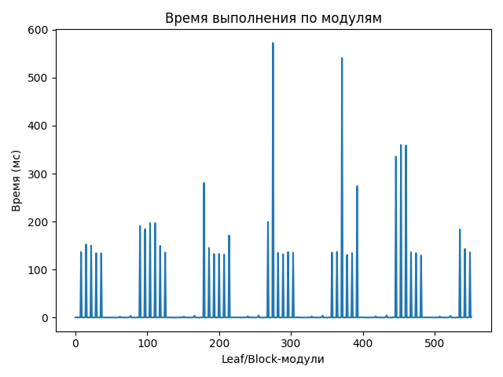
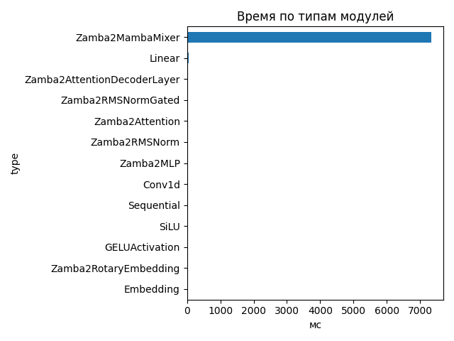
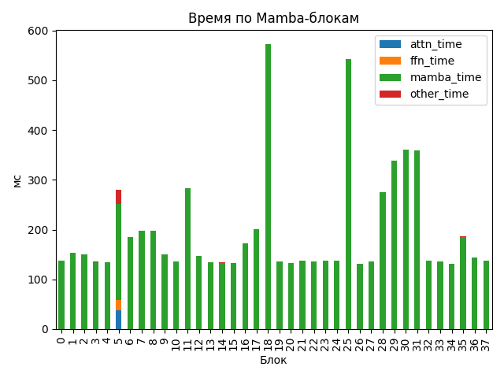

# Zamba2 1.2B

## Общие параметры
- Время forward-pass: 7369.70 ms
- Размер скрытого пространства: 2048
- Размер словаря: 32000
- Длина входной последовательности: 156
- Количество блоков: 38
- Количество параметров: 1 280 351 744

## FLOPs (оценка по трейсу)
- Linear + Conv1d: 1871.70 GFLOPs (99.6%)
- Attention kernel (QK^T + AV): 4.78 GFLOPs (0.3%)
- Mamba SSM: 2.70 GFLOPs (0.1%)
- Итого: 1879.19 GFLOPs
- Эффективная производительность: 0.25 TFLOPs

## Графики

## Пример информации по одному блоку
- Номер блока: 0
- Есть Mamba-блок: False
- Есть Mamba decoder: False
- Есть shared Transformer: False
- Размер скрытого пространства: 2048
- Размер внутреннего пространства FFN (если есть): None
- FLOPs Attention: 0.000 GF
- FLOPs FFN: 0.000 GF
- FLOPs Mamba: 32.209 GF

### Эффективность по блокам
| Номер блока | Mamba (GF) | Attention (GF) | FFN (GF) | Эффективность (TFLOPs) |
|---|---|---|---|---|
| 0 | 32.209 | 0.000 | 0.000 | 0.23 |
| 1 | 32.209 | 0.000 | 0.000 | 0.21 |
| 2 | 32.209 | 0.000 | 0.000 | 0.21 |
| 3 | 32.209 | 0.000 | 0.000 | 0.24 |
| 4 | 32.209 | 0.000 | 0.000 | 0.24 |
| 5 | 64.418 | 236.411 | 197.275 | 1.79 |
| 6 | 32.209 | 0.000 | 0.000 | 0.17 |
| 7 | 32.209 | 0.000 | 0.000 | 0.16 |
| 8 | 32.209 | 0.000 | 0.000 | 0.16 |
| 9 | 32.209 | 0.000 | 0.000 | 0.21 |
| 10 | 32.209 | 0.000 | 0.000 | 0.24 |
| 11 | 64.418 | 0.000 | 0.000 | 0.23 |
| 12 | 32.209 | 0.000 | 0.000 | 0.22 |
| 13 | 32.209 | 0.000 | 0.000 | 0.24 |
| 14 | 32.209 | 0.000 | 0.000 | 0.24 |
| 15 | 32.209 | 0.000 | 0.000 | 0.24 |
| 16 | 32.209 | 0.000 | 0.000 | 0.19 |
| 17 | 64.418 | 0.000 | 0.000 | 0.33 |
| 18 | 32.209 | 0.000 | 0.000 | 0.06 |
| 19 | 32.209 | 0.000 | 0.000 | 0.24 |
| 20 | 32.209 | 0.000 | 0.000 | 0.24 |
| 21 | 32.209 | 0.000 | 0.000 | 0.23 |
| 22 | 32.209 | 0.000 | 0.000 | 0.24 |
| 23 | 64.418 | 0.000 | 0.000 | 0.48 |
| 24 | 32.209 | 0.000 | 0.000 | 0.23 |
| 25 | 32.209 | 0.000 | 0.000 | 0.06 |
| 26 | 32.209 | 0.000 | 0.000 | 0.24 |
| 27 | 32.209 | 0.000 | 0.000 | 0.24 |
| 28 | 32.209 | 0.000 | 0.000 | 0.12 |
| 29 | 64.418 | 0.000 | 0.000 | 0.19 |
| 30 | 32.209 | 0.000 | 0.000 | 0.09 |
| 31 | 32.209 | 0.000 | 0.000 | 0.09 |
| 32 | 32.209 | 0.000 | 0.000 | 0.23 |
| 33 | 32.209 | 0.000 | 0.000 | 0.24 |
| 34 | 32.209 | 0.000 | 0.000 | 0.25 |
| 35 | 64.418 | 0.000 | 0.000 | 0.35 |
| 36 | 32.209 | 0.000 | 0.000 | 0.22 |
| 37 | 32.209 | 0.000 | 0.000 | 0.23 |

## Сводная таблица времени по типам модулей
| Тип | Кол-во | Суммарное время (мс) | Среднее (мс) |
|-----|--------|------------------------|---------------|
| Zamba2MambaMixer | 38 | 7332.222 | 192.9532 |
| Linear | 263 | 56.270 | 0.2140 |
| Zamba2AttentionDecoderLayer | 6 | 24.518 | 4.0863 |
| Zamba2RMSNormGated | 44 | 17.700 | 0.4023 |
| Zamba2Attention | 6 | 14.316 | 2.3861 |
| Zamba2RMSNorm | 63 | 8.988 | 0.1427 |
| Zamba2MLP | 6 | 7.426 | 1.2376 |
| Conv1d | 44 | 6.068 | 0.1379 |
| Sequential | 24 | 5.331 | 0.2221 |
| SiLU | 44 | 2.059 | 0.0468 |
| GELUActivation | 12 | 0.741 | 0.0618 |
| Zamba2RotaryEmbedding | 1 | 0.240 | 0.2402 |
| Embedding | 1 | 0.182 | 0.1818 |

## Самые медленные модули (20)
- 572.073 ms — `model.layers.18.mamba` (Zamba2MambaMixer)
- 540.900 ms — `model.layers.25.mamba` (Zamba2MambaMixer)
- 359.937 ms — `model.layers.30.mamba` (Zamba2MambaMixer)
- 358.589 ms — `model.layers.31.mamba` (Zamba2MambaMixer)
- 335.705 ms — `model.layers.29.mamba_decoder.mamba` (Zamba2MambaMixer)
- 280.525 ms — `model.layers.11.mamba_decoder.mamba` (Zamba2MambaMixer)
- 273.843 ms — `model.layers.28.mamba` (Zamba2MambaMixer)
- 199.347 ms — `model.layers.17.mamba_decoder.mamba` (Zamba2MambaMixer)
- 196.949 ms — `model.layers.7.mamba` (Zamba2MambaMixer)
- 196.909 ms — `model.layers.8.mamba` (Zamba2MambaMixer)
- 190.789 ms — `model.layers.5.mamba_decoder.mamba` (Zamba2MambaMixer)
- 184.348 ms — `model.layers.6.mamba` (Zamba2MambaMixer)
- 183.673 ms — `model.layers.35.mamba_decoder.mamba` (Zamba2MambaMixer)
- 171.275 ms — `model.layers.16.mamba` (Zamba2MambaMixer)
- 152.217 ms — `model.layers.1.mamba` (Zamba2MambaMixer)
- 149.770 ms — `model.layers.2.mamba` (Zamba2MambaMixer)
- 149.413 ms — `model.layers.9.mamba` (Zamba2MambaMixer)
- 145.221 ms — `model.layers.12.mamba` (Zamba2MambaMixer)
- 142.979 ms — `model.layers.36.mamba` (Zamba2MambaMixer)
- 137.021 ms — `model.layers.24.mamba` (Zamba2MambaMixer)
