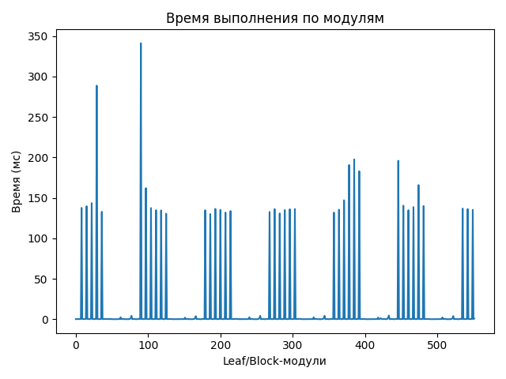
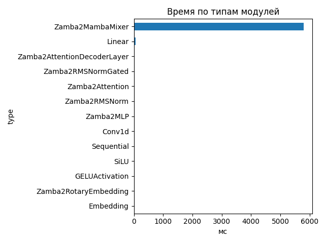
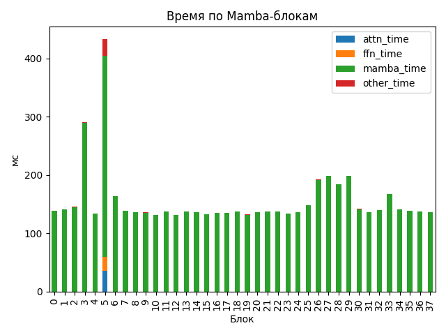

# Zamba2 1.2B

## Общие параметры
- Время forward-pass: 5840.08 ms
- Размер скрытого пространства: 2048
- Размер словаря: 32000
- Длина входной последовательности: 200
- Количество блоков: 38
- Количество параметров: 1 280 351 744

## FLOPs (оценка по трейсу)
- Linear + Conv1d: 2393.98 GFLOPs (99.5%)
- Attention kernel (QK^T + AV): 7.86 GFLOPs (0.3%)
- Mamba SSM: 3.46 GFLOPs (0.1%)
- Итого: 2405.30 GFLOPs
- Эффективная производительность: 0.41 TFLOPs

## Графики

## Пример информации по одному блоку
- Номер блока: 0
- Есть Mamba-блок: False
- Есть Mamba decoder: False
- Есть shared Transformer: False
- Размер скрытого пространства: 2048
- Размер внутреннего пространства FFN (если есть): None
- FLOPs Attention: 0.000 GF
- FLOPs FFN: 0.000 GF
- FLOPs Mamba: 41.166 GF

### Эффективность по блокам
| Номер блока | Mamba (GF) | Attention (GF) | FFN (GF) | Эффективность (TFLOPs) |
|---|---|---|---|---|
| 0 | 41.166 | 0.000 | 0.000 | 0.30 |
| 1 | 41.166 | 0.000 | 0.000 | 0.29 |
| 2 | 41.166 | 0.000 | 0.000 | 0.28 |
| 3 | 41.166 | 0.000 | 0.000 | 0.14 |
| 4 | 41.166 | 0.000 | 0.000 | 0.31 |
| 5 | 82.331 | 304.821 | 252.917 | 1.48 |
| 6 | 41.166 | 0.000 | 0.000 | 0.25 |
| 7 | 41.166 | 0.000 | 0.000 | 0.30 |
| 8 | 41.166 | 0.000 | 0.000 | 0.30 |
| 9 | 41.166 | 0.000 | 0.000 | 0.30 |
| 10 | 41.166 | 0.000 | 0.000 | 0.31 |
| 11 | 82.331 | 0.000 | 0.000 | 0.61 |
| 12 | 41.166 | 0.000 | 0.000 | 0.31 |
| 13 | 41.166 | 0.000 | 0.000 | 0.30 |
| 14 | 41.166 | 0.000 | 0.000 | 0.30 |
| 15 | 41.166 | 0.000 | 0.000 | 0.31 |
| 16 | 41.166 | 0.000 | 0.000 | 0.30 |
| 17 | 82.331 | 0.000 | 0.000 | 0.62 |
| 18 | 41.166 | 0.000 | 0.000 | 0.30 |
| 19 | 41.166 | 0.000 | 0.000 | 0.31 |
| 20 | 41.166 | 0.000 | 0.000 | 0.30 |
| 21 | 41.166 | 0.000 | 0.000 | 0.30 |
| 22 | 41.166 | 0.000 | 0.000 | 0.30 |
| 23 | 82.331 | 0.000 | 0.000 | 0.63 |
| 24 | 41.166 | 0.000 | 0.000 | 0.30 |
| 25 | 41.166 | 0.000 | 0.000 | 0.28 |
| 26 | 41.166 | 0.000 | 0.000 | 0.21 |
| 27 | 41.166 | 0.000 | 0.000 | 0.21 |
| 28 | 41.166 | 0.000 | 0.000 | 0.22 |
| 29 | 82.331 | 0.000 | 0.000 | 0.42 |
| 30 | 41.166 | 0.000 | 0.000 | 0.29 |
| 31 | 41.166 | 0.000 | 0.000 | 0.30 |
| 32 | 41.166 | 0.000 | 0.000 | 0.29 |
| 33 | 41.166 | 0.000 | 0.000 | 0.25 |
| 34 | 41.166 | 0.000 | 0.000 | 0.29 |
| 35 | 82.331 | 0.000 | 0.000 | 0.60 |
| 36 | 41.166 | 0.000 | 0.000 | 0.30 |
| 37 | 41.166 | 0.000 | 0.000 | 0.30 |

## Сводная таблица времени по типам модулей
| Тип | Кол-во | Суммарное время (мс) | Среднее (мс) |
|-----|--------|------------------------|---------------|
| Zamba2MambaMixer | 38 | 5801.626 | 152.6744 |
| Linear | 263 | 58.002 | 0.2205 |
| Zamba2AttentionDecoderLayer | 6 | 25.335 | 4.2225 |
| Zamba2RMSNormGated | 44 | 19.317 | 0.4390 |
| Zamba2Attention | 6 | 13.719 | 2.2864 |
| Zamba2RMSNorm | 63 | 9.905 | 0.1572 |
| Zamba2MLP | 6 | 8.672 | 1.4454 |
| Conv1d | 44 | 6.098 | 0.1386 |
| Sequential | 24 | 4.920 | 0.2050 |
| SiLU | 44 | 2.017 | 0.0458 |
| GELUActivation | 12 | 0.728 | 0.0607 |
| Zamba2RotaryEmbedding | 1 | 0.241 | 0.2413 |
| Embedding | 1 | 0.123 | 0.1231 |

## Самые медленные модули (20)
- 341.146 ms — `model.layers.5.mamba_decoder.mamba` (Zamba2MambaMixer)
- 288.765 ms — `model.layers.3.mamba` (Zamba2MambaMixer)
- 197.587 ms — `model.layers.27.mamba` (Zamba2MambaMixer)
- 195.942 ms — `model.layers.29.mamba_decoder.mamba` (Zamba2MambaMixer)
- 190.673 ms — `model.layers.26.mamba` (Zamba2MambaMixer)
- 182.993 ms — `model.layers.28.mamba` (Zamba2MambaMixer)
- 165.914 ms — `model.layers.33.mamba` (Zamba2MambaMixer)
- 162.057 ms — `model.layers.6.mamba` (Zamba2MambaMixer)
- 147.016 ms — `model.layers.25.mamba` (Zamba2MambaMixer)
- 143.581 ms — `model.layers.2.mamba` (Zamba2MambaMixer)
- 140.460 ms — `model.layers.30.mamba` (Zamba2MambaMixer)
- 139.934 ms — `model.layers.34.mamba` (Zamba2MambaMixer)
- 139.746 ms — `model.layers.1.mamba` (Zamba2MambaMixer)
- 138.644 ms — `model.layers.32.mamba` (Zamba2MambaMixer)
- 137.728 ms — `model.layers.0.mamba` (Zamba2MambaMixer)
- 137.478 ms — `model.layers.7.mamba` (Zamba2MambaMixer)
- 136.826 ms — `model.layers.35.mamba_decoder.mamba` (Zamba2MambaMixer)
- 136.385 ms — `model.layers.13.mamba` (Zamba2MambaMixer)
- 136.226 ms — `model.layers.36.mamba` (Zamba2MambaMixer)
- 136.186 ms — `model.layers.18.mamba` (Zamba2MambaMixer)
