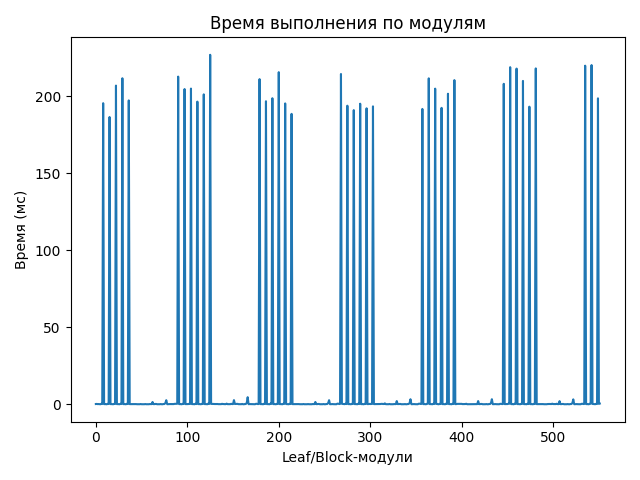
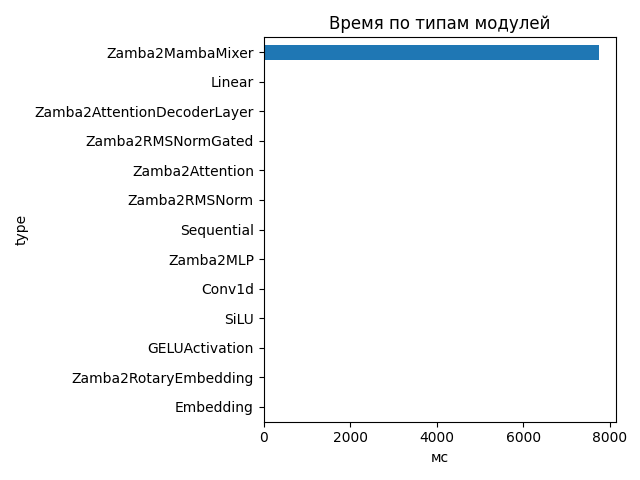
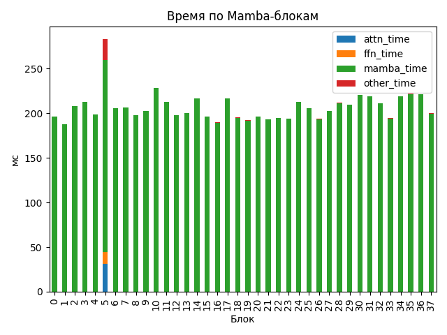

# Zamba2 1.2B

## Общие параметры
- Время forward-pass: 7787.12 ms
- Размер скрытого пространства: 2048
- Размер словаря: 32000
- Длина входной последовательности: 24
- Количество блоков: 38
- Количество параметров: 1 280 351 744

## FLOPs (оценка по трейсу)
- Linear + Conv1d: 304.88 GFLOPs (99.8%)
- Attention kernel (QK^T + AV): 0.11 GFLOPs (0.0%)
- Mamba SSM: 0.42 GFLOPs (0.1%)
- Итого: 305.41 GFLOPs
- Эффективная производительность: 0.04 TFLOPs

## Графики

## Пример информации по одному блоку
- Номер блока: 0
- Есть Mamba-блок: False
- Есть Mamba decoder: False
- Есть shared Transformer: False
- Размер скрытого пространства: 2048
- Размер внутреннего пространства FFN (если есть): None
- FLOPs Attention: 0.000 GF
- FLOPs FFN: 0.000 GF
- FLOPs Mamba: 5.340 GF

### Эффективность по блокам
| Номер блока | Mamba (GF) | Attention (GF) | FFN (GF) | Эффективность (TFLOPs) |
|---|---|---|---|---|
| 0 | 5.340 | 0.000 | 0.000 | 0.03 |
| 1 | 5.340 | 0.000 | 0.000 | 0.03 |
| 2 | 5.340 | 0.000 | 0.000 | 0.03 |
| 3 | 5.340 | 0.000 | 0.000 | 0.03 |
| 4 | 5.340 | 0.000 | 0.000 | 0.03 |
| 5 | 10.680 | 35.748 | 30.350 | 0.27 |
| 6 | 5.340 | 0.000 | 0.000 | 0.03 |
| 7 | 5.340 | 0.000 | 0.000 | 0.03 |
| 8 | 5.340 | 0.000 | 0.000 | 0.03 |
| 9 | 5.340 | 0.000 | 0.000 | 0.03 |
| 10 | 5.340 | 0.000 | 0.000 | 0.02 |
| 11 | 10.680 | 0.000 | 0.000 | 0.05 |
| 12 | 5.340 | 0.000 | 0.000 | 0.03 |
| 13 | 5.340 | 0.000 | 0.000 | 0.03 |
| 14 | 5.340 | 0.000 | 0.000 | 0.02 |
| 15 | 5.340 | 0.000 | 0.000 | 0.03 |
| 16 | 5.340 | 0.000 | 0.000 | 0.03 |
| 17 | 10.680 | 0.000 | 0.000 | 0.05 |
| 18 | 5.340 | 0.000 | 0.000 | 0.03 |
| 19 | 5.340 | 0.000 | 0.000 | 0.03 |
| 20 | 5.340 | 0.000 | 0.000 | 0.03 |
| 21 | 5.340 | 0.000 | 0.000 | 0.03 |
| 22 | 5.340 | 0.000 | 0.000 | 0.03 |
| 23 | 10.680 | 0.000 | 0.000 | 0.06 |
| 24 | 5.340 | 0.000 | 0.000 | 0.03 |
| 25 | 5.340 | 0.000 | 0.000 | 0.03 |
| 26 | 5.340 | 0.000 | 0.000 | 0.03 |
| 27 | 5.340 | 0.000 | 0.000 | 0.03 |
| 28 | 5.340 | 0.000 | 0.000 | 0.03 |
| 29 | 10.680 | 0.000 | 0.000 | 0.05 |
| 30 | 5.340 | 0.000 | 0.000 | 0.02 |
| 31 | 5.340 | 0.000 | 0.000 | 0.02 |
| 32 | 5.340 | 0.000 | 0.000 | 0.03 |
| 33 | 5.340 | 0.000 | 0.000 | 0.03 |
| 34 | 5.340 | 0.000 | 0.000 | 0.02 |
| 35 | 10.680 | 0.000 | 0.000 | 0.05 |
| 36 | 5.340 | 0.000 | 0.000 | 0.02 |
| 37 | 5.340 | 0.000 | 0.000 | 0.03 |

## Сводная таблица времени по типам модулей
| Тип | Кол-во | Суммарное время (мс) | Среднее (мс) |
|-----|--------|------------------------|---------------|
| Zamba2MambaMixer | 38 | 7754.246 | 204.0591 |
| Linear | 263 | 38.430 | 0.1461 |
| Zamba2AttentionDecoderLayer | 6 | 19.822 | 3.3036 |
| Zamba2RMSNormGated | 44 | 15.948 | 0.3625 |
| Zamba2Attention | 6 | 11.984 | 1.9974 |
| Zamba2RMSNorm | 63 | 9.057 | 0.1438 |
| Sequential | 24 | 5.725 | 0.2385 |
| Zamba2MLP | 6 | 4.904 | 0.8173 |
| Conv1d | 44 | 4.564 | 0.1037 |
| SiLU | 44 | 2.387 | 0.0542 |
| GELUActivation | 12 | 0.564 | 0.0470 |
| Zamba2RotaryEmbedding | 1 | 0.240 | 0.2402 |
| Embedding | 1 | 0.187 | 0.1873 |

## Самые медленные модули (20)
- 227.064 ms — `model.layers.10.mamba` (Zamba2MambaMixer)
- 220.395 ms — `model.layers.36.mamba` (Zamba2MambaMixer)
- 219.987 ms — `model.layers.35.mamba_decoder.mamba` (Zamba2MambaMixer)
- 219.022 ms — `model.layers.30.mamba` (Zamba2MambaMixer)
- 218.225 ms — `model.layers.34.mamba` (Zamba2MambaMixer)
- 218.102 ms — `model.layers.31.mamba` (Zamba2MambaMixer)
- 215.783 ms — `model.layers.14.mamba` (Zamba2MambaMixer)
- 214.596 ms — `model.layers.17.mamba_decoder.mamba` (Zamba2MambaMixer)
- 212.897 ms — `model.layers.5.mamba_decoder.mamba` (Zamba2MambaMixer)
- 211.834 ms — `model.layers.3.mamba` (Zamba2MambaMixer)
- 211.774 ms — `model.layers.24.mamba` (Zamba2MambaMixer)
- 211.267 ms — `model.layers.11.mamba_decoder.mamba` (Zamba2MambaMixer)
- 210.628 ms — `model.layers.28.mamba` (Zamba2MambaMixer)
- 210.081 ms — `model.layers.32.mamba` (Zamba2MambaMixer)
- 208.221 ms — `model.layers.29.mamba_decoder.mamba` (Zamba2MambaMixer)
- 207.054 ms — `model.layers.2.mamba` (Zamba2MambaMixer)
- 205.113 ms — `model.layers.7.mamba` (Zamba2MambaMixer)
- 205.075 ms — `model.layers.25.mamba` (Zamba2MambaMixer)
- 204.820 ms — `model.layers.6.mamba` (Zamba2MambaMixer)
- 201.760 ms — `model.layers.27.mamba` (Zamba2MambaMixer)
