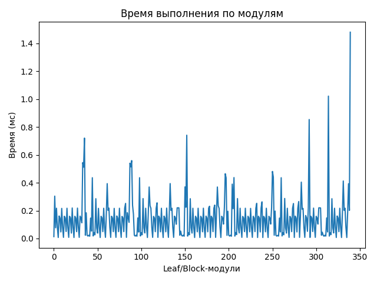
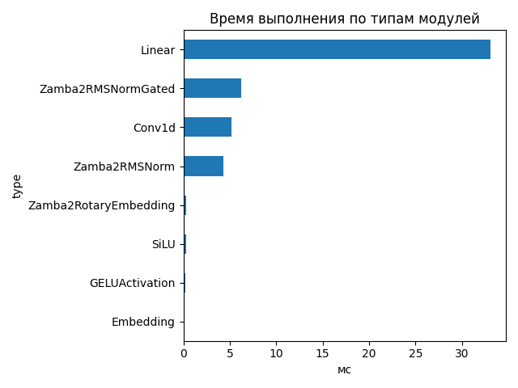
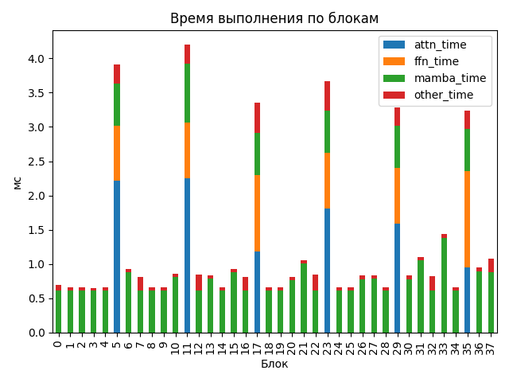

# Zamba2 1.2B

## Общие параметры
- Время forward-pass: 2875.89 ms
- Размер скрытого пространства: 2048
- Размер словаря: 32000
- Длина входной последовательности: 256
- Количество блоков: 38
- Количество параметров: 1 215 064 704

## FLOPs (оценка по трейсу)
- Linear + Conv1d: 2391.99 GFLOPs (99.6%)
- Attention kernel (QK^T + AV): 6.44 GFLOPs (0.3%)
- Mamba SSM: 3.83 GFLOPs (0.2%)
- Итого: 2402.26 GFLOPs
- Эффективная производительность: 0.84 TFLOPs

## Графики

## Пример информации по одному блоку
- Номер блока: 0
- Есть Mamba-блок: True
- Есть Mamba decoder: False
- Есть shared Transformer: False
- Размер скрытого пространства: 2048
- Размер внутреннего пространства FFN (если есть): None
- FLOPs Attention: 0.000 GF
- FLOPs FFN: 0.000 GF
- FLOPs Mamba: 52.565 GF

### Эффективность по блокам
| Номер блока | Mamba (GF) | Attention (GF) | FFN (GF) | Эффективность (TFLOPs) |
|---|---|---|---|---|
| 0 | 52.565 | 0.000 | 0.000 | 76.15 |
| 1 | 52.565 | 0.000 | 0.000 | 79.83 |
| 2 | 52.565 | 0.000 | 0.000 | 79.27 |
| 3 | 52.565 | 0.000 | 0.000 | 80.69 |
| 4 | 52.565 | 0.000 | 0.000 | 79.09 |
| 5 | 52.565 | 32.749 | 26.978 | 29.22 |
| 6 | 52.565 | 0.000 | 0.000 | 56.48 |
| 7 | 52.565 | 0.000 | 0.000 | 64.49 |
| 8 | 52.565 | 0.000 | 0.000 | 79.32 |
| 9 | 52.565 | 0.000 | 0.000 | 79.50 |
| 10 | 52.565 | 0.000 | 0.000 | 61.12 |
| 11 | 52.565 | 32.749 | 26.978 | 27.22 |
| 12 | 52.565 | 0.000 | 0.000 | 62.15 |
| 13 | 52.565 | 0.000 | 0.000 | 62.77 |
| 14 | 52.565 | 0.000 | 0.000 | 79.71 |
| 15 | 52.565 | 0.000 | 0.000 | 56.66 |
| 16 | 52.565 | 0.000 | 0.000 | 64.52 |
| 17 | 52.565 | 32.749 | 26.978 | 34.09 |
| 18 | 52.565 | 0.000 | 0.000 | 79.82 |
| 19 | 52.565 | 0.000 | 0.000 | 79.55 |
| 20 | 52.565 | 0.000 | 0.000 | 64.69 |
| 21 | 52.565 | 0.000 | 0.000 | 49.60 |
| 22 | 52.565 | 0.000 | 0.000 | 62.15 |
| 23 | 52.565 | 32.749 | 26.978 | 31.21 |
| 24 | 52.565 | 0.000 | 0.000 | 79.21 |
| 25 | 52.565 | 0.000 | 0.000 | 79.71 |
| 26 | 52.565 | 0.000 | 0.000 | 63.18 |
| 27 | 52.565 | 0.000 | 0.000 | 62.51 |
| 28 | 52.565 | 0.000 | 0.000 | 79.72 |
| 29 | 52.565 | 32.749 | 26.978 | 34.91 |
| 30 | 52.565 | 0.000 | 0.000 | 63.19 |
| 31 | 52.565 | 0.000 | 0.000 | 47.71 |
| 32 | 52.565 | 0.000 | 0.000 | 63.51 |
| 33 | 52.565 | 0.000 | 0.000 | 36.58 |
| 34 | 52.565 | 0.000 | 0.000 | 79.22 |
| 35 | 52.565 | 32.749 | 26.978 | 35.40 |
| 36 | 52.565 | 0.000 | 0.000 | 55.50 |
| 37 | 52.565 | 0.000 | 0.000 | 48.46 |

## Сводная таблица времени по типам модулей
| Тип | Кол-во | Суммарное время (мс) | Среднее (мс) |
|-----|--------|------------------------|---------------|
| Linear | 167 | 33.086 | 0.1981 |
| Zamba2RMSNormGated | 38 | 6.236 | 0.1641 |
| Conv1d | 38 | 5.207 | 0.1370 |
| Zamba2RMSNorm | 51 | 4.281 | 0.0839 |
| Zamba2RotaryEmbedding | 1 | 0.304 | 0.3041 |
| SiLU | 38 | 0.295 | 0.0078 |
| GELUActivation | 6 | 0.162 | 0.0270 |
| Embedding | 1 | 0.013 | 0.0133 |

## Самые медленные модули (20)
- 1.481 ms — `lm_head` (Linear)
- 1.022 ms — `model.layers.5.shared_transformer.feed_forward.gate_up_proj` (Linear)
- 0.854 ms — `model.layers.33.mamba.conv1d` (Conv1d)
- 0.741 ms — `model.layers.5.shared_transformer.feed_forward.gate_up_proj` (Linear)
- 0.721 ms — `model.layers.5.shared_transformer.self_attn.v_proj` (Linear)
- 0.559 ms — `model.layers.5.shared_transformer.self_attn.v_proj` (Linear)
- 0.545 ms — `model.layers.5.shared_transformer.self_attn.q_proj` (Linear)
- 0.541 ms — `model.layers.5.shared_transformer.self_attn.q_proj` (Linear)
- 0.514 ms — `model.layers.5.shared_transformer.self_attn.k_proj` (Linear)
- 0.512 ms — `model.layers.5.shared_transformer.self_attn.k_proj` (Linear)
- 0.481 ms — `model.layers.5.shared_transformer.self_attn.k_proj` (Linear)
- 0.465 ms — `model.layers.5.shared_transformer.self_attn.k_proj` (Linear)
- 0.441 ms — `model.layers.5.shared_transformer.self_attn.v_proj` (Linear)
- 0.437 ms — `model.layers.5.shared_transformer.feed_forward.gate_up_proj` (Linear)
- 0.436 ms — `model.layers.5.shared_transformer.feed_forward.gate_up_proj` (Linear)
- 0.436 ms — `model.layers.5.shared_transformer.feed_forward.gate_up_proj` (Linear)
- 0.436 ms — `model.layers.5.shared_transformer.feed_forward.gate_up_proj` (Linear)
- 0.435 ms — `model.layers.5.shared_transformer.self_attn.v_proj` (Linear)
- 0.413 ms — `model.layers.36.mamba.out_proj` (Linear)
- 0.404 ms — `model.layers.31.mamba.out_proj` (Linear)
