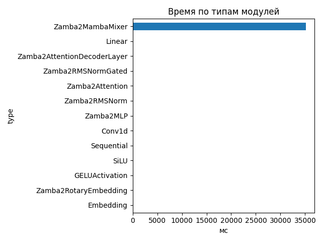
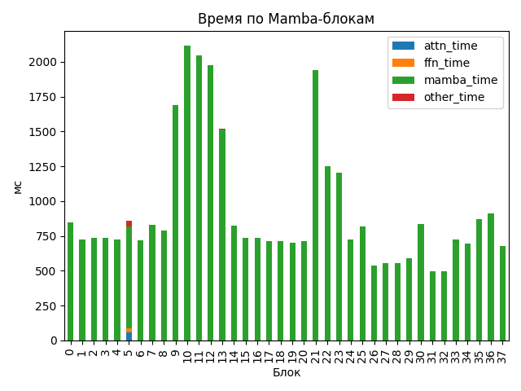

# Zamba2 1.2B

## Общие параметры
- Время forward-pass: 35193.46 ms
- Размер скрытого пространства: 2048
- Размер словаря: 32000
- Длина входной последовательности: 277
- Количество блоков: 38
- Количество параметров: 1 280 351 744

## FLOPs (оценка по трейсу)
- Linear + Conv1d: 3307.96 GFLOPs (99.4%)
- Attention kernel (QK^T + AV): 15.09 GFLOPs (0.5%)
- Mamba SSM: 4.79 GFLOPs (0.1%)
- Итого: 3327.84 GFLOPs
- Эффективная производительность: 0.09 TFLOPs

## Графики

## Пример информации по одному блоку
- Номер блока: 0
- Есть Mamba-блок: False
- Есть Mamba decoder: False
- Есть shared Transformer: False
- Размер скрытого пространства: 2048
- Размер внутреннего пространства FFN (если есть): None
- FLOPs Attention: 0.000 GF
- FLOPs FFN: 0.000 GF
- FLOPs Mamba: 56.839 GF

### Эффективность по блокам
| Номер блока | Mamba (GF) | Attention (GF) | FFN (GF) | Эффективность (TFLOPs) |
|---|---|---|---|---|
| 0 | 56.839 | 0.000 | 0.000 | 0.07 |
| 1 | 56.839 | 0.000 | 0.000 | 0.08 |
| 2 | 56.839 | 0.000 | 0.000 | 0.08 |
| 3 | 56.839 | 0.000 | 0.000 | 0.08 |
| 4 | 56.839 | 0.000 | 0.000 | 0.08 |
| 5 | 113.678 | 426.371 | 350.289 | 1.04 |
| 6 | 56.839 | 0.000 | 0.000 | 0.08 |
| 7 | 56.839 | 0.000 | 0.000 | 0.07 |
| 8 | 56.839 | 0.000 | 0.000 | 0.07 |
| 9 | 56.839 | 0.000 | 0.000 | 0.03 |
| 10 | 56.839 | 0.000 | 0.000 | 0.03 |
| 11 | 113.678 | 0.000 | 0.000 | 0.06 |
| 12 | 56.839 | 0.000 | 0.000 | 0.03 |
| 13 | 56.839 | 0.000 | 0.000 | 0.04 |
| 14 | 56.839 | 0.000 | 0.000 | 0.07 |
| 15 | 56.839 | 0.000 | 0.000 | 0.08 |
| 16 | 56.839 | 0.000 | 0.000 | 0.08 |
| 17 | 113.678 | 0.000 | 0.000 | 0.16 |
| 18 | 56.839 | 0.000 | 0.000 | 0.08 |
| 19 | 56.839 | 0.000 | 0.000 | 0.08 |
| 20 | 56.839 | 0.000 | 0.000 | 0.08 |
| 21 | 56.839 | 0.000 | 0.000 | 0.03 |
| 22 | 56.839 | 0.000 | 0.000 | 0.05 |
| 23 | 113.678 | 0.000 | 0.000 | 0.10 |
| 24 | 56.839 | 0.000 | 0.000 | 0.08 |
| 25 | 56.839 | 0.000 | 0.000 | 0.07 |
| 26 | 56.839 | 0.000 | 0.000 | 0.11 |
| 27 | 56.839 | 0.000 | 0.000 | 0.10 |
| 28 | 56.839 | 0.000 | 0.000 | 0.10 |
| 29 | 113.678 | 0.000 | 0.000 | 0.20 |
| 30 | 56.839 | 0.000 | 0.000 | 0.07 |
| 31 | 56.839 | 0.000 | 0.000 | 0.11 |
| 32 | 56.839 | 0.000 | 0.000 | 0.11 |
| 33 | 56.839 | 0.000 | 0.000 | 0.08 |
| 34 | 56.839 | 0.000 | 0.000 | 0.08 |
| 35 | 113.678 | 0.000 | 0.000 | 0.13 |
| 36 | 56.839 | 0.000 | 0.000 | 0.06 |
| 37 | 56.839 | 0.000 | 0.000 | 0.08 |

## Сводная таблица времени по типам модулей
| Тип | Кол-во | Суммарное время (мс) | Среднее (мс) |
|-----|--------|------------------------|---------------|
| Zamba2MambaMixer | 38 | 35144.103 | 924.8448 |
| Linear | 263 | 86.475 | 0.3288 |
| Zamba2AttentionDecoderLayer | 6 | 34.908 | 5.8179 |
| Zamba2RMSNormGated | 44 | 22.237 | 0.5054 |
| Zamba2Attention | 6 | 21.065 | 3.5108 |
| Zamba2RMSNorm | 63 | 10.491 | 0.1665 |
| Zamba2MLP | 6 | 10.432 | 1.7387 |
| Conv1d | 44 | 7.449 | 0.1693 |
| Sequential | 24 | 5.003 | 0.2085 |
| SiLU | 44 | 2.278 | 0.0518 |
| GELUActivation | 12 | 0.889 | 0.0741 |
| Zamba2RotaryEmbedding | 1 | 0.253 | 0.2530 |
| Embedding | 1 | 0.197 | 0.1969 |

## Самые медленные модули (20)
- 2116.260 ms — `model.layers.10.mamba` (Zamba2MambaMixer)
- 2042.442 ms — `model.layers.11.mamba_decoder.mamba` (Zamba2MambaMixer)
- 1973.562 ms — `model.layers.12.mamba` (Zamba2MambaMixer)
- 1937.522 ms — `model.layers.21.mamba` (Zamba2MambaMixer)
- 1689.370 ms — `model.layers.9.mamba` (Zamba2MambaMixer)
- 1515.066 ms — `model.layers.13.mamba` (Zamba2MambaMixer)
- 1249.151 ms — `model.layers.22.mamba` (Zamba2MambaMixer)
- 1203.323 ms — `model.layers.23.mamba_decoder.mamba` (Zamba2MambaMixer)
- 909.056 ms — `model.layers.36.mamba` (Zamba2MambaMixer)
- 870.313 ms — `model.layers.35.mamba_decoder.mamba` (Zamba2MambaMixer)
- 847.715 ms — `model.layers.0.mamba` (Zamba2MambaMixer)
- 836.933 ms — `model.layers.30.mamba` (Zamba2MambaMixer)
- 829.265 ms — `model.layers.7.mamba` (Zamba2MambaMixer)
- 819.826 ms — `model.layers.14.mamba` (Zamba2MambaMixer)
- 816.314 ms — `model.layers.25.mamba` (Zamba2MambaMixer)
- 788.922 ms — `model.layers.8.mamba` (Zamba2MambaMixer)
- 737.246 ms — `model.layers.15.mamba` (Zamba2MambaMixer)
- 734.197 ms — `model.layers.2.mamba` (Zamba2MambaMixer)
- 732.349 ms — `model.layers.3.mamba` (Zamba2MambaMixer)
- 732.288 ms — `model.layers.16.mamba` (Zamba2MambaMixer)
