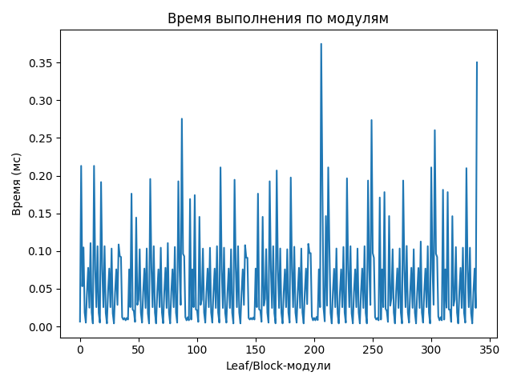
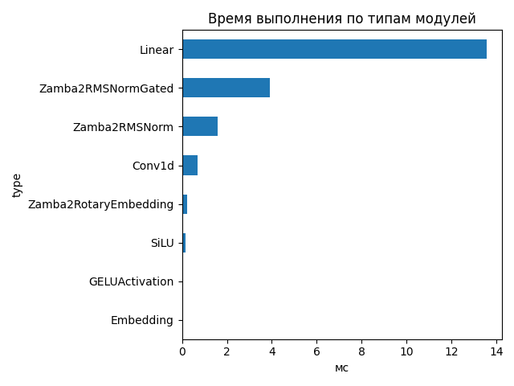
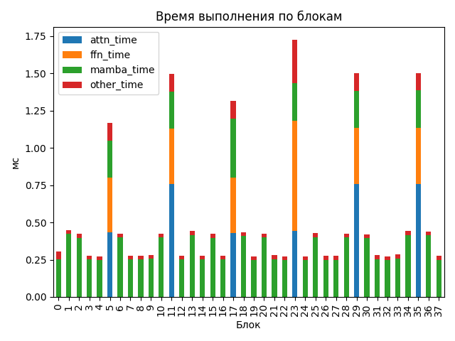

# Zamba2 1.2B

## Общие параметры
- Время forward-pass: 1700.40 ms
- Размер скрытого пространства: 2048
- Размер словаря: 32000
- Длина входной последовательности: 32
- Количество блоков: 38
- Количество параметров: 1 215 064 704

## FLOPs (оценка по трейсу)
- Linear + Conv1d: 314.11 GFLOPs (99.8%)
- Attention kernel (QK^T + AV): 0.10 GFLOPs (0.0%)
- Mamba SSM: 0.48 GFLOPs (0.2%)
- Итого: 314.69 GFLOPs
- Эффективная производительность: 0.19 TFLOPs

## Графики

## Пример информации по одному блоку
- Номер блока: 0
- Есть Mamba-блок: True
- Есть Mamba decoder: False
- Есть shared Transformer: False
- Размер скрытого пространства: 2048
- Размер внутреннего пространства FFN (если есть): None
- FLOPs Attention: 0.000 GF
- FLOPs FFN: 0.000 GF
- FLOPs Mamba: 6.968 GF

### Эффективность по блокам
| Номер блока | Mamba (GF) | Attention (GF) | FFN (GF) | Эффективность (TFLOPs) |
|---|---|---|---|---|
| 0 | 6.968 | 0.000 | 0.000 | 22.81 |
| 1 | 6.968 | 0.000 | 0.000 | 15.60 |
| 2 | 6.968 | 0.000 | 0.000 | 16.49 |
| 3 | 6.968 | 0.000 | 0.000 | 25.05 |
| 4 | 6.968 | 0.000 | 0.000 | 25.59 |
| 5 | 6.968 | 3.976 | 3.372 | 12.48 |
| 6 | 6.968 | 0.000 | 0.000 | 16.48 |
| 7 | 6.968 | 0.000 | 0.000 | 25.20 |
| 8 | 6.968 | 0.000 | 0.000 | 25.17 |
| 9 | 6.968 | 0.000 | 0.000 | 24.92 |
| 10 | 6.968 | 0.000 | 0.000 | 16.40 |
| 11 | 6.968 | 3.976 | 3.372 | 9.74 |
| 12 | 6.968 | 0.000 | 0.000 | 25.22 |
| 13 | 6.968 | 0.000 | 0.000 | 15.79 |
| 14 | 6.968 | 0.000 | 0.000 | 25.32 |
| 15 | 6.968 | 0.000 | 0.000 | 16.50 |
| 16 | 6.968 | 0.000 | 0.000 | 25.20 |
| 17 | 6.968 | 3.976 | 3.372 | 11.09 |
| 18 | 6.968 | 0.000 | 0.000 | 15.99 |
| 19 | 6.968 | 0.000 | 0.000 | 25.61 |
| 20 | 6.968 | 0.000 | 0.000 | 16.36 |
| 21 | 6.968 | 0.000 | 0.000 | 25.00 |
| 22 | 6.968 | 0.000 | 0.000 | 25.50 |
| 23 | 6.968 | 3.976 | 3.372 | 8.45 |
| 24 | 6.968 | 0.000 | 0.000 | 25.58 |
| 25 | 6.968 | 0.000 | 0.000 | 16.33 |
| 26 | 6.968 | 0.000 | 0.000 | 25.29 |
| 27 | 6.968 | 0.000 | 0.000 | 25.40 |
| 28 | 6.968 | 0.000 | 0.000 | 16.45 |
| 29 | 6.968 | 3.976 | 3.372 | 9.71 |
| 30 | 6.968 | 0.000 | 0.000 | 16.60 |
| 31 | 6.968 | 0.000 | 0.000 | 24.90 |
| 32 | 6.968 | 0.000 | 0.000 | 25.52 |
| 33 | 6.968 | 0.000 | 0.000 | 24.57 |
| 34 | 6.968 | 0.000 | 0.000 | 15.75 |
| 35 | 6.968 | 3.976 | 3.372 | 9.71 |
| 36 | 6.968 | 0.000 | 0.000 | 15.90 |
| 37 | 6.968 | 0.000 | 0.000 | 25.37 |

## Сводная таблица времени по типам модулей
| Тип | Кол-во | Суммарное время (мс) | Среднее (мс) |
|-----|--------|------------------------|---------------|
| Linear | 167 | 13.571 | 0.0813 |
| Zamba2RMSNormGated | 38 | 3.908 | 0.1029 |
| Zamba2RMSNorm | 51 | 1.577 | 0.0309 |
| Conv1d | 38 | 0.692 | 0.0182 |
| Zamba2RotaryEmbedding | 1 | 0.213 | 0.2130 |
| SiLU | 38 | 0.171 | 0.0045 |
| GELUActivation | 6 | 0.038 | 0.0063 |
| Embedding | 1 | 0.006 | 0.0065 |

## Самые медленные модули (20)
- 0.375 ms — `model.layers.5.shared_transformer.feed_forward.gate_up_proj` (Linear)
- 0.350 ms — `lm_head` (Linear)
- 0.275 ms — `model.layers.5.shared_transformer.self_attn.q_proj` (Linear)
- 0.274 ms — `model.layers.5.shared_transformer.self_attn.q_proj` (Linear)
- 0.260 ms — `model.layers.5.shared_transformer.self_attn.q_proj` (Linear)
- 0.213 ms — `model.rotary_emb` (Zamba2RotaryEmbedding)
- 0.213 ms — `model.layers.1.mamba.norm` (Zamba2RMSNormGated)
- 0.211 ms — `model.layers.13.mamba.norm` (Zamba2RMSNormGated)
- 0.211 ms — `model.layers.23.mamba_decoder.input_layernorm` (Zamba2RMSNorm)
- 0.211 ms — `model.layers.34.mamba.norm` (Zamba2RMSNormGated)
- 0.210 ms — `model.layers.36.mamba.norm` (Zamba2RMSNormGated)
- 0.207 ms — `model.layers.18.mamba.norm` (Zamba2RMSNormGated)
- 0.198 ms — `model.layers.20.mamba.norm` (Zamba2RMSNormGated)
- 0.196 ms — `model.layers.25.mamba.norm` (Zamba2RMSNormGated)
- 0.196 ms — `model.layers.6.mamba.norm` (Zamba2RMSNormGated)
- 0.195 ms — `model.layers.15.mamba.norm` (Zamba2RMSNormGated)
- 0.194 ms — `model.layers.28.mamba.norm` (Zamba2RMSNormGated)
- 0.194 ms — `model.layers.30.mamba.norm` (Zamba2RMSNormGated)
- 0.193 ms — `model.layers.10.mamba.norm` (Zamba2RMSNormGated)
- 0.193 ms — `model.layers.17.mamba_decoder.mamba.norm` (Zamba2RMSNormGated)
