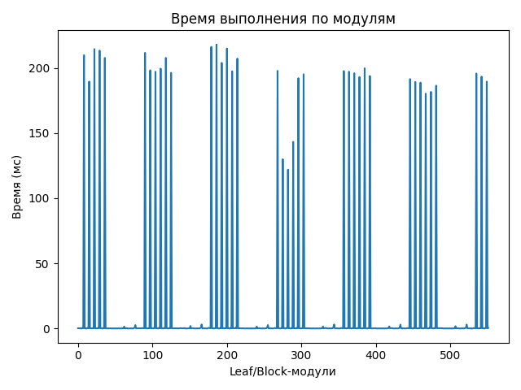
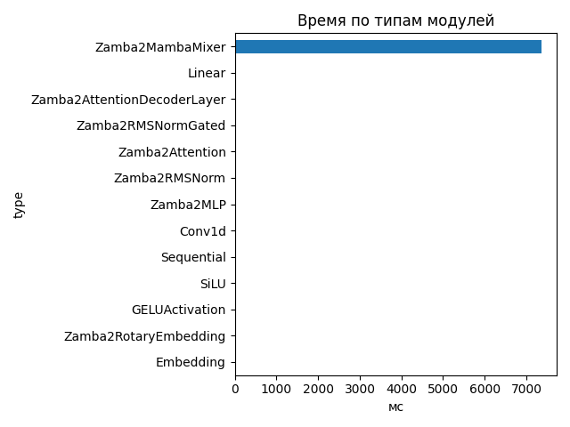
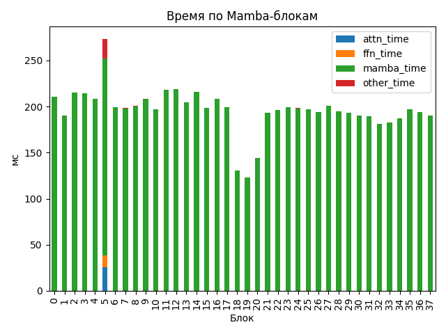

# Zamba2 1.2B

## Общие параметры
- Время forward-pass: 7387.66 ms
- Размер скрытого пространства: 2048
- Размер словаря: 32000
- Длина входной последовательности: 35
- Количество блоков: 38
- Количество параметров: 1 280 351 744

## FLOPs (оценка по трейсу)
- Linear + Conv1d: 435.45 GFLOPs (99.8%)
- Attention kernel (QK^T + AV): 0.24 GFLOPs (0.1%)
- Mamba SSM: 0.61 GFLOPs (0.1%)
- Итого: 436.29 GFLOPs
- Эффективная производительность: 0.06 TFLOPs

## Графики

## Пример информации по одному блоку
- Номер блока: 0
- Есть Mamba-блок: False
- Есть Mamba decoder: False
- Есть shared Transformer: False
- Размер скрытого пространства: 2048
- Размер внутреннего пространства FFN (если есть): None
- FLOPs Attention: 0.000 GF
- FLOPs FFN: 0.000 GF
- FLOPs Mamba: 7.579 GF

### Эффективность по блокам
| Номер блока | Mamba (GF) | Attention (GF) | FFN (GF) | Эффективность (TFLOPs) |
|---|---|---|---|---|
| 0 | 7.579 | 0.000 | 0.000 | 0.04 |
| 1 | 7.579 | 0.000 | 0.000 | 0.04 |
| 2 | 7.579 | 0.000 | 0.000 | 0.04 |
| 3 | 7.579 | 0.000 | 0.000 | 0.04 |
| 4 | 7.579 | 0.000 | 0.000 | 0.04 |
| 5 | 15.158 | 52.208 | 44.260 | 0.41 |
| 6 | 7.579 | 0.000 | 0.000 | 0.04 |
| 7 | 7.579 | 0.000 | 0.000 | 0.04 |
| 8 | 7.579 | 0.000 | 0.000 | 0.04 |
| 9 | 7.579 | 0.000 | 0.000 | 0.04 |
| 10 | 7.579 | 0.000 | 0.000 | 0.04 |
| 11 | 15.158 | 0.000 | 0.000 | 0.07 |
| 12 | 7.579 | 0.000 | 0.000 | 0.03 |
| 13 | 7.579 | 0.000 | 0.000 | 0.04 |
| 14 | 7.579 | 0.000 | 0.000 | 0.04 |
| 15 | 7.579 | 0.000 | 0.000 | 0.04 |
| 16 | 7.579 | 0.000 | 0.000 | 0.04 |
| 17 | 15.158 | 0.000 | 0.000 | 0.08 |
| 18 | 7.579 | 0.000 | 0.000 | 0.06 |
| 19 | 7.579 | 0.000 | 0.000 | 0.06 |
| 20 | 7.579 | 0.000 | 0.000 | 0.05 |
| 21 | 7.579 | 0.000 | 0.000 | 0.04 |
| 22 | 7.579 | 0.000 | 0.000 | 0.04 |
| 23 | 15.158 | 0.000 | 0.000 | 0.08 |
| 24 | 7.579 | 0.000 | 0.000 | 0.04 |
| 25 | 7.579 | 0.000 | 0.000 | 0.04 |
| 26 | 7.579 | 0.000 | 0.000 | 0.04 |
| 27 | 7.579 | 0.000 | 0.000 | 0.04 |
| 28 | 7.579 | 0.000 | 0.000 | 0.04 |
| 29 | 15.158 | 0.000 | 0.000 | 0.08 |
| 30 | 7.579 | 0.000 | 0.000 | 0.04 |
| 31 | 7.579 | 0.000 | 0.000 | 0.04 |
| 32 | 7.579 | 0.000 | 0.000 | 0.04 |
| 33 | 7.579 | 0.000 | 0.000 | 0.04 |
| 34 | 7.579 | 0.000 | 0.000 | 0.04 |
| 35 | 15.158 | 0.000 | 0.000 | 0.08 |
| 36 | 7.579 | 0.000 | 0.000 | 0.04 |
| 37 | 7.579 | 0.000 | 0.000 | 0.04 |

## Сводная таблица времени по типам модулей
| Тип | Кол-во | Суммарное время (мс) | Среднее (мс) |
|-----|--------|------------------------|---------------|
| Zamba2MambaMixer | 38 | 7358.452 | 193.6435 |
| Linear | 263 | 34.431 | 0.1309 |
| Zamba2AttentionDecoderLayer | 6 | 17.523 | 2.9205 |
| Zamba2RMSNormGated | 44 | 16.900 | 0.3841 |
| Zamba2Attention | 6 | 9.952 | 1.6586 |
| Zamba2RMSNorm | 63 | 8.517 | 0.1352 |
| Zamba2MLP | 6 | 4.899 | 0.8165 |
| Conv1d | 44 | 4.442 | 0.1010 |
| Sequential | 24 | 4.349 | 0.1812 |
| SiLU | 44 | 2.063 | 0.0469 |
| GELUActivation | 12 | 0.549 | 0.0457 |
| Zamba2RotaryEmbedding | 1 | 0.247 | 0.2468 |
| Embedding | 1 | 0.195 | 0.1953 |

## Самые медленные модули (20)
- 218.010 ms — `model.layers.12.mamba` (Zamba2MambaMixer)
- 216.232 ms — `model.layers.11.mamba_decoder.mamba` (Zamba2MambaMixer)
- 214.955 ms — `model.layers.14.mamba` (Zamba2MambaMixer)
- 214.526 ms — `model.layers.2.mamba` (Zamba2MambaMixer)
- 213.382 ms — `model.layers.3.mamba` (Zamba2MambaMixer)
- 211.646 ms — `model.layers.5.mamba_decoder.mamba` (Zamba2MambaMixer)
- 209.812 ms — `model.layers.0.mamba` (Zamba2MambaMixer)
- 207.781 ms — `model.layers.9.mamba` (Zamba2MambaMixer)
- 207.764 ms — `model.layers.4.mamba` (Zamba2MambaMixer)
- 207.169 ms — `model.layers.16.mamba` (Zamba2MambaMixer)
- 203.931 ms — `model.layers.13.mamba` (Zamba2MambaMixer)
- 199.820 ms — `model.layers.27.mamba` (Zamba2MambaMixer)
- 199.531 ms — `model.layers.8.mamba` (Zamba2MambaMixer)
- 198.247 ms — `model.layers.6.mamba` (Zamba2MambaMixer)
- 197.842 ms — `model.layers.17.mamba_decoder.mamba` (Zamba2MambaMixer)
- 197.684 ms — `model.layers.23.mamba_decoder.mamba` (Zamba2MambaMixer)
- 197.501 ms — `model.layers.15.mamba` (Zamba2MambaMixer)
- 197.216 ms — `model.layers.24.mamba` (Zamba2MambaMixer)
- 197.182 ms — `model.layers.7.mamba` (Zamba2MambaMixer)
- 196.274 ms — `model.layers.10.mamba` (Zamba2MambaMixer)
