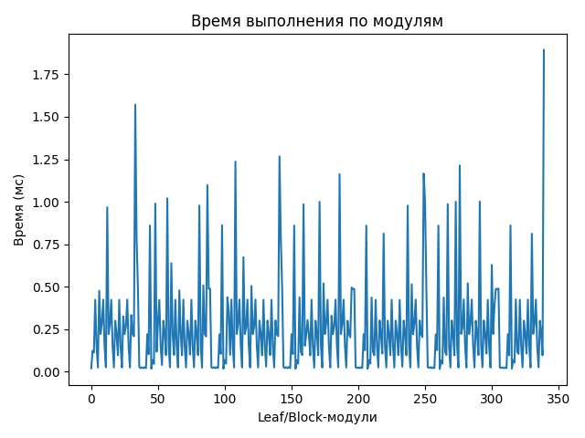
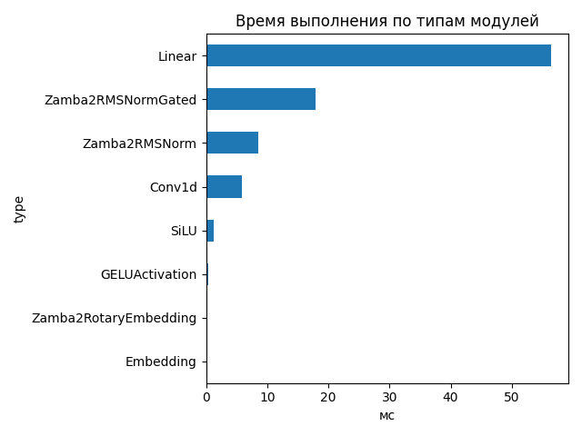
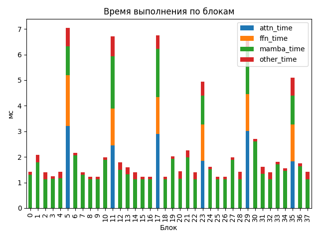

# Zamba2 1.2B

## Общие параметры
- Время forward-pass: 30716.75 ms
- Размер скрытого пространства: 2048
- Размер словаря: 32000
- Длина входной последовательности: 512
- Количество блоков: 38
- Количество параметров: 1 215 064 704

## FLOPs (оценка по трейсу)
- Linear + Conv1d: 4766.70 GFLOPs (99.3%)
- Attention kernel (QK^T + AV): 25.77 GFLOPs (0.5%)
- Mamba SSM: 7.65 GFLOPs (0.2%)
- Итого: 4800.12 GFLOPs
- Эффективная производительность: 0.16 TFLOPs

## Графики

## Пример информации по одному блоку
- Номер блока: 0
- Есть Mamba-блок: True
- Есть Mamba decoder: False
- Есть shared Transformer: False
- Размер скрытого пространства: 2048
- Размер внутреннего пространства FFN (если есть): None
- FLOPs Attention: 0.000 GF
- FLOPs FFN: 0.000 GF
- FLOPs Mamba: 104.675 GF

### Эффективность по блокам
| Номер блока | Mamba (GF) | Attention (GF) | FFN (GF) | Эффективность (TFLOPs) |
|---|---|---|---|---|
| 0 | 104.675 | 0.000 | 0.000 | 73.93 |
| 1 | 104.675 | 0.000 | 0.000 | 50.22 |
| 2 | 104.675 | 0.000 | 0.000 | 74.40 |
| 3 | 104.675 | 0.000 | 0.000 | 84.07 |
| 4 | 104.675 | 0.000 | 0.000 | 73.35 |
| 5 | 104.675 | 67.646 | 53.956 | 32.71 |
| 6 | 104.675 | 0.000 | 0.000 | 48.49 |
| 7 | 104.675 | 0.000 | 0.000 | 74.66 |
| 8 | 104.675 | 0.000 | 0.000 | 85.62 |
| 9 | 104.675 | 0.000 | 0.000 | 85.44 |
| 10 | 104.675 | 0.000 | 0.000 | 52.76 |
| 11 | 104.675 | 67.646 | 53.956 | 34.38 |
| 12 | 104.675 | 0.000 | 0.000 | 58.69 |
| 13 | 104.675 | 0.000 | 0.000 | 65.82 |
| 14 | 104.675 | 0.000 | 0.000 | 75.10 |
| 15 | 104.675 | 0.000 | 0.000 | 85.26 |
| 16 | 104.675 | 0.000 | 0.000 | 85.43 |
| 17 | 104.675 | 67.646 | 53.956 | 34.17 |
| 18 | 104.675 | 0.000 | 0.000 | 85.88 |
| 19 | 104.675 | 0.000 | 0.000 | 51.78 |
| 20 | 104.675 | 0.000 | 0.000 | 72.71 |
| 21 | 104.675 | 0.000 | 0.000 | 46.39 |
| 22 | 104.675 | 0.000 | 0.000 | 74.38 |
| 23 | 104.675 | 67.646 | 53.956 | 46.65 |
| 24 | 104.675 | 0.000 | 0.000 | 64.56 |
| 25 | 104.675 | 0.000 | 0.000 | 85.54 |
| 26 | 104.675 | 0.000 | 0.000 | 85.40 |
| 27 | 104.675 | 0.000 | 0.000 | 52.66 |
| 28 | 104.675 | 0.000 | 0.000 | 74.18 |
| 29 | 104.675 | 67.646 | 53.956 | 34.49 |
| 30 | 104.675 | 0.000 | 0.000 | 38.62 |
| 31 | 104.675 | 0.000 | 0.000 | 65.15 |
| 32 | 104.675 | 0.000 | 0.000 | 74.25 |
| 33 | 104.675 | 0.000 | 0.000 | 58.11 |
| 34 | 104.675 | 0.000 | 0.000 | 67.07 |
| 35 | 104.675 | 67.646 | 53.956 | 45.24 |
| 36 | 104.675 | 0.000 | 0.000 | 59.96 |
| 37 | 104.675 | 0.000 | 0.000 | 74.20 |

## Сводная таблица времени по типам модулей
| Тип | Кол-во | Суммарное время (мс) | Среднее (мс) |
|-----|--------|------------------------|---------------|
| Linear | 167 | 56.439 | 0.3380 |
| Zamba2RMSNormGated | 38 | 17.875 | 0.4704 |
| Zamba2RMSNorm | 51 | 8.481 | 0.1663 |
| Conv1d | 38 | 5.788 | 0.1523 |
| SiLU | 38 | 1.192 | 0.0314 |
| GELUActivation | 6 | 0.294 | 0.0490 |
| Zamba2RotaryEmbedding | 1 | 0.124 | 0.1239 |
| Embedding | 1 | 0.020 | 0.0205 |

## Самые медленные модули (20)
- 1.892 ms — `lm_head` (Linear)
- 1.571 ms — `model.layers.5.shared_transformer.self_attn.q_proj` (Linear)
- 1.267 ms — `model.layers.5.shared_transformer.self_attn.q_proj` (Linear)
- 1.236 ms — `model.layers.11.mamba_decoder.mamba.norm` (Zamba2RMSNormGated)
- 1.213 ms — `model.layers.30.mamba.norm` (Zamba2RMSNormGated)
- 1.166 ms — `model.layers.5.shared_transformer.self_attn.q_proj` (Linear)
- 1.162 ms — `model.layers.21.mamba.norm` (Zamba2RMSNormGated)
- 1.098 ms — `model.layers.5.shared_transformer.self_attn.q_proj` (Linear)
- 1.020 ms — `model.layers.6.mamba.in_proj` (Linear)
- 1.001 ms — `model.layers.33.mamba.in_proj` (Linear)
- 1.000 ms — `model.layers.30.mamba.in_proj` (Linear)
- 0.999 ms — `model.layers.19.mamba.in_proj` (Linear)
- 0.997 ms — `model.layers.5.shared_transformer.self_attn.k_proj` (Linear)
- 0.989 ms — `model.layers.5.shared_transformer.feed_forward.down_proj` (Linear)
- 0.986 ms — `model.layers.29.mamba_decoder.mamba.in_proj` (Linear)
- 0.985 ms — `model.layers.17.mamba_decoder.mamba.in_proj` (Linear)
- 0.978 ms — `model.layers.10.mamba.in_proj` (Linear)
- 0.977 ms — `model.layers.27.mamba.in_proj` (Linear)
- 0.968 ms — `model.layers.1.mamba.norm` (Zamba2RMSNormGated)
- 0.862 ms — `model.layers.5.shared_transformer.feed_forward.gate_up_proj` (Linear)
