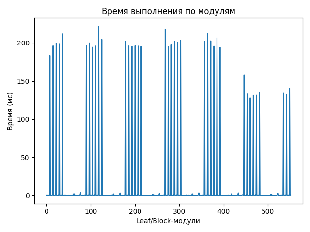
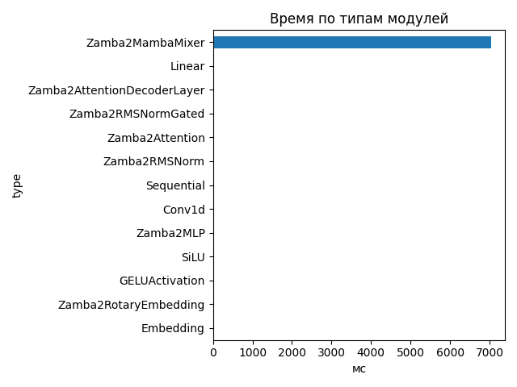
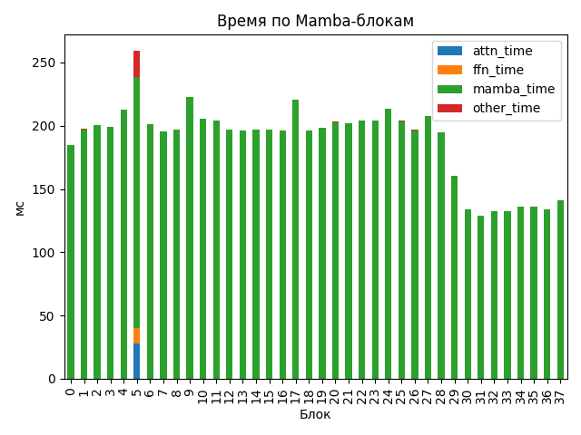

# Zamba2 1.2B

## Общие параметры
- Время forward-pass: 7067.12 ms
- Размер скрытого пространства: 2048
- Размер словаря: 32000
- Длина входной последовательности: 57
- Количество блоков: 38
- Количество параметров: 1 280 351 744

## FLOPs (оценка по трейсу)
- Linear + Conv1d: 696.58 GFLOPs (99.8%)
- Attention kernel (QK^T + AV): 0.64 GFLOPs (0.1%)
- Mamba SSM: 0.99 GFLOPs (0.1%)
- Итого: 698.21 GFLOPs
- Эффективная производительность: 0.10 TFLOPs

## Графики

## Пример информации по одному блоку
- Номер блока: 0
- Есть Mamba-блок: False
- Есть Mamba decoder: False
- Есть shared Transformer: False
- Размер скрытого пространства: 2048
- Размер внутреннего пространства FFN (если есть): None
- FLOPs Attention: 0.000 GF
- FLOPs FFN: 0.000 GF
- FLOPs Mamba: 12.057 GF

### Эффективность по блокам
| Номер блока | Mamba (GF) | Attention (GF) | FFN (GF) | Эффективность (TFLOPs) |
|---|---|---|---|---|
| 0 | 12.057 | 0.000 | 0.000 | 0.07 |
| 1 | 12.057 | 0.000 | 0.000 | 0.06 |
| 2 | 12.057 | 0.000 | 0.000 | 0.06 |
| 3 | 12.057 | 0.000 | 0.000 | 0.06 |
| 4 | 12.057 | 0.000 | 0.000 | 0.06 |
| 5 | 24.114 | 85.271 | 72.081 | 0.70 |
| 6 | 12.057 | 0.000 | 0.000 | 0.06 |
| 7 | 12.057 | 0.000 | 0.000 | 0.06 |
| 8 | 12.057 | 0.000 | 0.000 | 0.06 |
| 9 | 12.057 | 0.000 | 0.000 | 0.05 |
| 10 | 12.057 | 0.000 | 0.000 | 0.06 |
| 11 | 24.114 | 0.000 | 0.000 | 0.12 |
| 12 | 12.057 | 0.000 | 0.000 | 0.06 |
| 13 | 12.057 | 0.000 | 0.000 | 0.06 |
| 14 | 12.057 | 0.000 | 0.000 | 0.06 |
| 15 | 12.057 | 0.000 | 0.000 | 0.06 |
| 16 | 12.057 | 0.000 | 0.000 | 0.06 |
| 17 | 24.114 | 0.000 | 0.000 | 0.11 |
| 18 | 12.057 | 0.000 | 0.000 | 0.06 |
| 19 | 12.057 | 0.000 | 0.000 | 0.06 |
| 20 | 12.057 | 0.000 | 0.000 | 0.06 |
| 21 | 12.057 | 0.000 | 0.000 | 0.06 |
| 22 | 12.057 | 0.000 | 0.000 | 0.06 |
| 23 | 24.114 | 0.000 | 0.000 | 0.12 |
| 24 | 12.057 | 0.000 | 0.000 | 0.06 |
| 25 | 12.057 | 0.000 | 0.000 | 0.06 |
| 26 | 12.057 | 0.000 | 0.000 | 0.06 |
| 27 | 12.057 | 0.000 | 0.000 | 0.06 |
| 28 | 12.057 | 0.000 | 0.000 | 0.06 |
| 29 | 24.114 | 0.000 | 0.000 | 0.15 |
| 30 | 12.057 | 0.000 | 0.000 | 0.09 |
| 31 | 12.057 | 0.000 | 0.000 | 0.09 |
| 32 | 12.057 | 0.000 | 0.000 | 0.09 |
| 33 | 12.057 | 0.000 | 0.000 | 0.09 |
| 34 | 12.057 | 0.000 | 0.000 | 0.09 |
| 35 | 24.114 | 0.000 | 0.000 | 0.18 |
| 36 | 12.057 | 0.000 | 0.000 | 0.09 |
| 37 | 12.057 | 0.000 | 0.000 | 0.09 |

## Сводная таблица времени по типам модулей
| Тип | Кол-во | Суммарное время (мс) | Среднее (мс) |
|-----|--------|------------------------|---------------|
| Zamba2MambaMixer | 38 | 7037.276 | 185.1915 |
| Linear | 263 | 37.686 | 0.1433 |
| Zamba2AttentionDecoderLayer | 6 | 17.949 | 2.9915 |
| Zamba2RMSNormGated | 44 | 16.211 | 0.3684 |
| Zamba2Attention | 6 | 10.969 | 1.8282 |
| Zamba2RMSNorm | 63 | 8.360 | 0.1327 |
| Sequential | 24 | 4.992 | 0.2080 |
| Conv1d | 44 | 4.755 | 0.1081 |
| Zamba2MLP | 6 | 4.571 | 0.7618 |
| SiLU | 44 | 2.614 | 0.0594 |
| GELUActivation | 12 | 0.561 | 0.0468 |
| Zamba2RotaryEmbedding | 1 | 0.244 | 0.2438 |
| Embedding | 1 | 0.186 | 0.1856 |

## Самые медленные модули (20)
- 221.478 ms — `model.layers.9.mamba` (Zamba2MambaMixer)
- 218.201 ms — `model.layers.17.mamba_decoder.mamba` (Zamba2MambaMixer)
- 212.216 ms — `model.layers.24.mamba` (Zamba2MambaMixer)
- 211.899 ms — `model.layers.4.mamba` (Zamba2MambaMixer)
- 206.774 ms — `model.layers.27.mamba` (Zamba2MambaMixer)
- 204.504 ms — `model.layers.10.mamba` (Zamba2MambaMixer)
- 203.192 ms — `model.layers.22.mamba` (Zamba2MambaMixer)
- 202.648 ms — `model.layers.25.mamba` (Zamba2MambaMixer)
- 202.242 ms — `model.layers.11.mamba_decoder.mamba` (Zamba2MambaMixer)
- 202.146 ms — `model.layers.23.mamba_decoder.mamba` (Zamba2MambaMixer)
- 201.954 ms — `model.layers.20.mamba` (Zamba2MambaMixer)
- 200.813 ms — `model.layers.21.mamba` (Zamba2MambaMixer)
- 199.908 ms — `model.layers.6.mamba` (Zamba2MambaMixer)
- 199.677 ms — `model.layers.2.mamba` (Zamba2MambaMixer)
- 198.298 ms — `model.layers.3.mamba` (Zamba2MambaMixer)
- 197.500 ms — `model.layers.19.mamba` (Zamba2MambaMixer)
- 196.509 ms — `model.layers.5.mamba_decoder.mamba` (Zamba2MambaMixer)
- 196.238 ms — `model.layers.1.mamba` (Zamba2MambaMixer)
- 196.216 ms — `model.layers.14.mamba` (Zamba2MambaMixer)
- 196.027 ms — `model.layers.12.mamba` (Zamba2MambaMixer)
