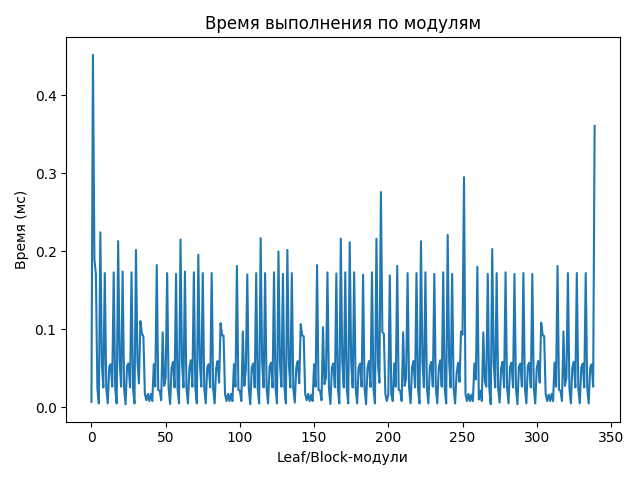
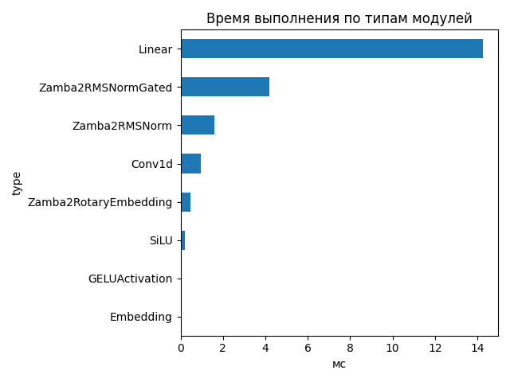
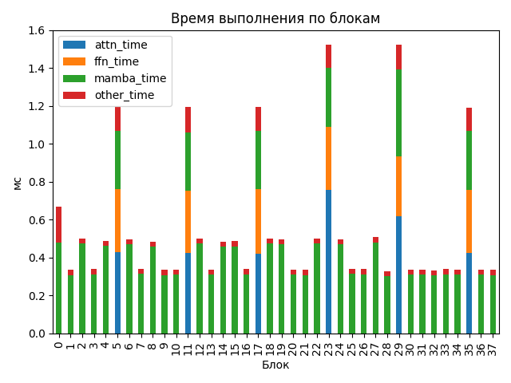

# Zamba2 1.2B

## Общие параметры
- Время forward-pass: 1731.35 ms
- Размер скрытого пространства: 2048
- Размер словаря: 32000
- Длина входной последовательности: 64
- Количество блоков: 38
- Количество параметров: 1 215 064 704

## FLOPs (оценка по трейсу)
- Linear + Conv1d: 610.95 GFLOPs (99.8%)
- Attention kernel (QK^T + AV): 0.40 GFLOPs (0.1%)
- Mamba SSM: 0.96 GFLOPs (0.2%)
- Итого: 612.31 GFLOPs
- Эффективная производительность: 0.35 TFLOPs

## Графики

## Пример информации по одному блоку
- Номер блока: 0
- Есть Mamba-блок: True
- Есть Mamba decoder: False
- Есть shared Transformer: False
- Размер скрытого пространства: 2048
- Размер внутреннего пространства FFN (если есть): None
- FLOPs Attention: 0.000 GF
- FLOPs FFN: 0.000 GF
- FLOPs Mamba: 13.482 GF

### Эффективность по блокам
| Номер блока | Mamba (GF) | Attention (GF) | FFN (GF) | Эффективность (TFLOPs) |
|---|---|---|---|---|
| 0 | 13.482 | 0.000 | 0.000 | 20.10 |
| 1 | 13.482 | 0.000 | 0.000 | 40.26 |
| 2 | 13.482 | 0.000 | 0.000 | 26.91 |
| 3 | 13.482 | 0.000 | 0.000 | 39.78 |
| 4 | 13.482 | 0.000 | 0.000 | 27.53 |
| 5 | 13.482 | 7.986 | 6.744 | 24.08 |
| 6 | 13.482 | 0.000 | 0.000 | 27.03 |
| 7 | 13.482 | 0.000 | 0.000 | 39.54 |
| 8 | 13.482 | 0.000 | 0.000 | 27.84 |
| 9 | 13.482 | 0.000 | 0.000 | 40.17 |
| 10 | 13.482 | 0.000 | 0.000 | 40.02 |
| 11 | 13.482 | 7.986 | 6.744 | 24.04 |
| 12 | 13.482 | 0.000 | 0.000 | 26.89 |
| 13 | 13.482 | 0.000 | 0.000 | 40.01 |
| 14 | 13.482 | 0.000 | 0.000 | 27.77 |
| 15 | 13.482 | 0.000 | 0.000 | 27.72 |
| 16 | 13.482 | 0.000 | 0.000 | 39.78 |
| 17 | 13.482 | 7.986 | 6.744 | 24.05 |
| 18 | 13.482 | 0.000 | 0.000 | 26.94 |
| 19 | 13.482 | 0.000 | 0.000 | 27.18 |
| 20 | 13.482 | 0.000 | 0.000 | 40.06 |
| 21 | 13.482 | 0.000 | 0.000 | 40.14 |
| 22 | 13.482 | 0.000 | 0.000 | 26.89 |
| 23 | 13.482 | 7.986 | 6.744 | 18.85 |
| 24 | 13.482 | 0.000 | 0.000 | 27.04 |
| 25 | 13.482 | 0.000 | 0.000 | 39.68 |
| 26 | 13.482 | 0.000 | 0.000 | 39.69 |
| 27 | 13.482 | 0.000 | 0.000 | 26.56 |
| 28 | 13.482 | 0.000 | 0.000 | 41.27 |
| 29 | 13.482 | 7.986 | 6.744 | 18.88 |
| 30 | 13.482 | 0.000 | 0.000 | 40.02 |
| 31 | 13.482 | 0.000 | 0.000 | 39.82 |
| 32 | 13.482 | 0.000 | 0.000 | 40.36 |
| 33 | 13.482 | 0.000 | 0.000 | 39.69 |
| 34 | 13.482 | 0.000 | 0.000 | 40.02 |
| 35 | 13.482 | 7.986 | 6.744 | 24.13 |
| 36 | 13.482 | 0.000 | 0.000 | 40.25 |
| 37 | 13.482 | 0.000 | 0.000 | 40.26 |

## Сводная таблица времени по типам модулей
| Тип | Кол-во | Суммарное время (мс) | Среднее (мс) |
|-----|--------|------------------------|---------------|
| Linear | 167 | 14.266 | 0.0854 |
| Zamba2RMSNormGated | 38 | 4.173 | 0.1098 |
| Zamba2RMSNorm | 51 | 1.604 | 0.0314 |
| Conv1d | 38 | 0.947 | 0.0249 |
| Zamba2RotaryEmbedding | 1 | 0.452 | 0.4516 |
| SiLU | 38 | 0.190 | 0.0050 |
| GELUActivation | 6 | 0.051 | 0.0085 |
| Embedding | 1 | 0.007 | 0.0071 |

## Самые медленные модули (20)
- 0.452 ms — `model.rotary_emb` (Zamba2RotaryEmbedding)
- 0.360 ms — `lm_head` (Linear)
- 0.295 ms — `model.layers.5.shared_transformer.self_attn.v_proj` (Linear)
- 0.276 ms — `model.layers.5.shared_transformer.self_attn.q_proj` (Linear)
- 0.224 ms — `model.layers.0.mamba.norm` (Zamba2RMSNormGated)
- 0.221 ms — `model.layers.27.mamba.norm` (Zamba2RMSNormGated)
- 0.217 ms — `model.layers.12.mamba.norm` (Zamba2RMSNormGated)
- 0.216 ms — `model.layers.18.mamba.norm` (Zamba2RMSNormGated)
- 0.216 ms — `model.layers.22.mamba.norm` (Zamba2RMSNormGated)
- 0.215 ms — `model.layers.6.mamba.norm` (Zamba2RMSNormGated)
- 0.213 ms — `model.layers.2.mamba.norm` (Zamba2RMSNormGated)
- 0.213 ms — `model.layers.24.mamba.norm` (Zamba2RMSNormGated)
- 0.212 ms — `model.layers.19.mamba.norm` (Zamba2RMSNormGated)
- 0.203 ms — `model.layers.29.mamba_decoder.mamba.norm` (Zamba2RMSNormGated)
- 0.202 ms — `model.layers.4.mamba.norm` (Zamba2RMSNormGated)
- 0.202 ms — `model.layers.15.mamba.norm` (Zamba2RMSNormGated)
- 0.200 ms — `model.layers.14.mamba.norm` (Zamba2RMSNormGated)
- 0.196 ms — `model.layers.8.mamba.norm` (Zamba2RMSNormGated)
- 0.189 ms — `model.layers.0.input_layernorm` (Zamba2RMSNorm)
- 0.182 ms — `model.layers.5.shared_transformer.feed_forward.gate_up_proj` (Linear)
