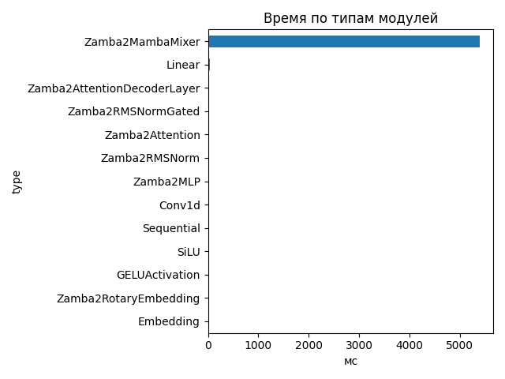
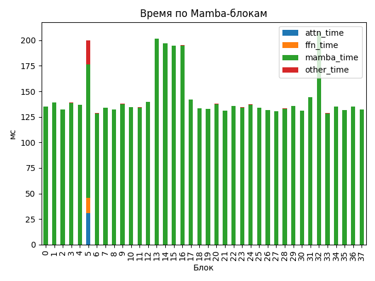

# Zamba2 1.2B

## Общие параметры
- Время forward-pass: 5423.18 ms
- Размер скрытого пространства: 2048
- Размер словаря: 32000
- Длина входной последовательности: 79
- Количество блоков: 38
- Количество параметров: 1 280 351 744

## FLOPs (оценка по трейсу)
- Linear + Conv1d: 957.72 GFLOPs (99.7%)
- Attention kernel (QK^T + AV): 1.23 GFLOPs (0.1%)
- Mamba SSM: 1.37 GFLOPs (0.1%)
- Итого: 960.31 GFLOPs
- Эффективная производительность: 0.18 TFLOPs

## Графики

## Пример информации по одному блоку
- Номер блока: 0
- Есть Mamba-блок: False
- Есть Mamba decoder: False
- Есть shared Transformer: False
- Размер скрытого пространства: 2048
- Размер внутреннего пространства FFN (если есть): None
- FLOPs Attention: 0.000 GF
- FLOPs FFN: 0.000 GF
- FLOPs Mamba: 16.535 GF

### Эффективность по блокам
| Номер блока | Mamba (GF) | Attention (GF) | FFN (GF) | Эффективность (TFLOPs) |
|---|---|---|---|---|
| 0 | 16.535 | 0.000 | 0.000 | 0.12 |
| 1 | 16.535 | 0.000 | 0.000 | 0.12 |
| 2 | 16.535 | 0.000 | 0.000 | 0.12 |
| 3 | 16.535 | 0.000 | 0.000 | 0.12 |
| 4 | 16.535 | 0.000 | 0.000 | 0.12 |
| 5 | 33.071 | 118.525 | 99.902 | 1.26 |
| 6 | 16.535 | 0.000 | 0.000 | 0.13 |
| 7 | 16.535 | 0.000 | 0.000 | 0.12 |
| 8 | 16.535 | 0.000 | 0.000 | 0.13 |
| 9 | 16.535 | 0.000 | 0.000 | 0.12 |
| 10 | 16.535 | 0.000 | 0.000 | 0.12 |
| 11 | 33.071 | 0.000 | 0.000 | 0.25 |
| 12 | 16.535 | 0.000 | 0.000 | 0.12 |
| 13 | 16.535 | 0.000 | 0.000 | 0.08 |
| 14 | 16.535 | 0.000 | 0.000 | 0.08 |
| 15 | 16.535 | 0.000 | 0.000 | 0.08 |
| 16 | 16.535 | 0.000 | 0.000 | 0.08 |
| 17 | 33.071 | 0.000 | 0.000 | 0.24 |
| 18 | 16.535 | 0.000 | 0.000 | 0.12 |
| 19 | 16.535 | 0.000 | 0.000 | 0.12 |
| 20 | 16.535 | 0.000 | 0.000 | 0.12 |
| 21 | 16.535 | 0.000 | 0.000 | 0.13 |
| 22 | 16.535 | 0.000 | 0.000 | 0.12 |
| 23 | 33.071 | 0.000 | 0.000 | 0.25 |
| 24 | 16.535 | 0.000 | 0.000 | 0.12 |
| 25 | 16.535 | 0.000 | 0.000 | 0.12 |
| 26 | 16.535 | 0.000 | 0.000 | 0.13 |
| 27 | 16.535 | 0.000 | 0.000 | 0.13 |
| 28 | 16.535 | 0.000 | 0.000 | 0.12 |
| 29 | 33.071 | 0.000 | 0.000 | 0.25 |
| 30 | 16.535 | 0.000 | 0.000 | 0.13 |
| 31 | 16.535 | 0.000 | 0.000 | 0.11 |
| 32 | 16.535 | 0.000 | 0.000 | 0.08 |
| 33 | 16.535 | 0.000 | 0.000 | 0.13 |
| 34 | 16.535 | 0.000 | 0.000 | 0.12 |
| 35 | 33.071 | 0.000 | 0.000 | 0.26 |
| 36 | 16.535 | 0.000 | 0.000 | 0.12 |
| 37 | 16.535 | 0.000 | 0.000 | 0.12 |

## Сводная таблица времени по типам модулей
| Тип | Кол-во | Суммарное время (мс) | Среднее (мс) |
|-----|--------|------------------------|---------------|
| Zamba2MambaMixer | 38 | 5391.575 | 141.8836 |
| Linear | 263 | 44.206 | 0.1681 |
| Zamba2AttentionDecoderLayer | 6 | 19.934 | 3.3224 |
| Zamba2RMSNormGated | 44 | 15.435 | 0.3508 |
| Zamba2Attention | 6 | 11.801 | 1.9668 |
| Zamba2RMSNorm | 63 | 8.521 | 0.1353 |
| Zamba2MLP | 6 | 5.566 | 0.9277 |
| Conv1d | 44 | 5.015 | 0.1140 |
| Sequential | 24 | 4.352 | 0.1813 |
| SiLU | 44 | 2.033 | 0.0462 |
| GELUActivation | 12 | 0.577 | 0.0481 |
| Zamba2RotaryEmbedding | 1 | 0.238 | 0.2377 |
| Embedding | 1 | 0.116 | 0.1161 |

## Самые медленные модули (20)
- 206.408 ms — `model.layers.32.mamba` (Zamba2MambaMixer)
- 200.517 ms — `model.layers.13.mamba` (Zamba2MambaMixer)
- 195.489 ms — `model.layers.14.mamba` (Zamba2MambaMixer)
- 193.790 ms — `model.layers.15.mamba` (Zamba2MambaMixer)
- 193.786 ms — `model.layers.16.mamba` (Zamba2MambaMixer)
- 142.982 ms — `model.layers.31.mamba` (Zamba2MambaMixer)
- 140.191 ms — `model.layers.17.mamba_decoder.mamba` (Zamba2MambaMixer)
- 138.612 ms — `model.layers.12.mamba` (Zamba2MambaMixer)
- 138.264 ms — `model.layers.1.mamba` (Zamba2MambaMixer)
- 137.835 ms — `model.layers.3.mamba` (Zamba2MambaMixer)
- 136.739 ms — `model.layers.20.mamba` (Zamba2MambaMixer)
- 136.666 ms — `model.layers.9.mamba` (Zamba2MambaMixer)
- 136.084 ms — `model.layers.24.mamba` (Zamba2MambaMixer)
- 135.797 ms — `model.layers.4.mamba` (Zamba2MambaMixer)
- 134.932 ms — `model.layers.22.mamba` (Zamba2MambaMixer)
- 134.171 ms — `model.layers.34.mamba` (Zamba2MambaMixer)
- 134.047 ms — `model.layers.0.mamba` (Zamba2MambaMixer)
- 133.784 ms — `model.layers.36.mamba` (Zamba2MambaMixer)
- 133.748 ms — `model.layers.29.mamba_decoder.mamba` (Zamba2MambaMixer)
- 133.337 ms — `model.layers.10.mamba` (Zamba2MambaMixer)
